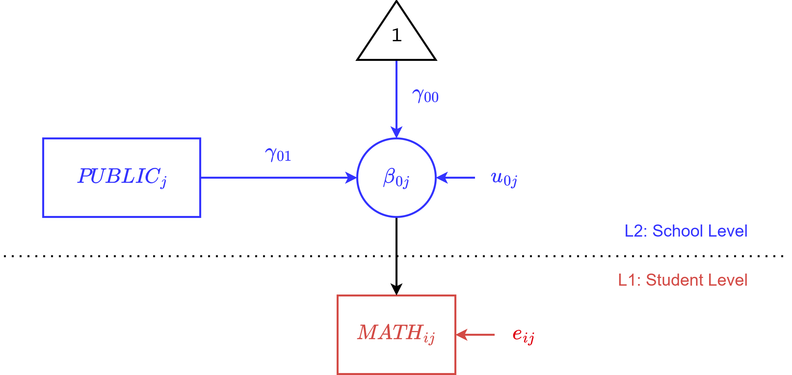
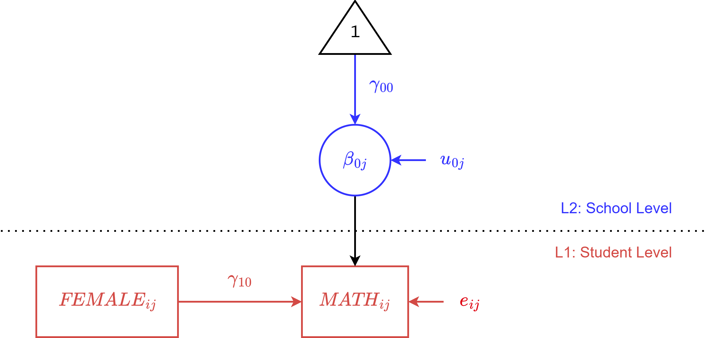
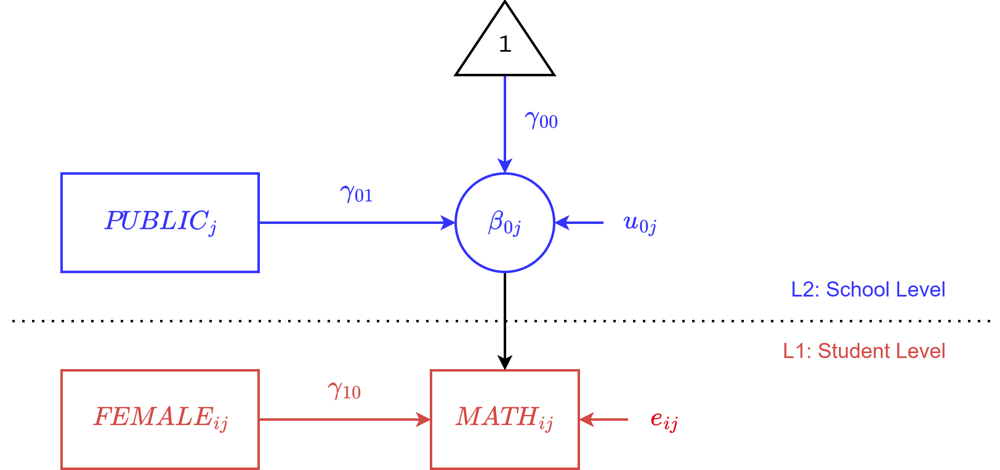

::: {.my-title}
# [Multilevel Modeling]{.blue}
Fixed Slopes

::: {.my-grey}
[ | CLAS | ]{}<br />
[Jeffrey M. Girard | Lecture ]{}
:::

{.absolute bottom=30 right=0 width="400"}
:::

```{r setup}
#| echo: false
#| message: false

library(tidyverse)
library(easystats)
library(patchwork)
library(here)

source(here("_common.R"))

set_theme(theme_gray(base_size = 20))
```

## Roadmap

::: {.columns .pv4}

::: {.column width="60%"}
1. Overview
    + *Slope Types and Rationales*
  
2. Fixed Slopes for L2
    + *Specifications and Examples*

3. Fixed Slopes for L1
    + *Specifications and Examples*
    
:::

::: {.column .tc .pv4 width="40%"}

:::

:::

# Fixed Slopes for L2

## L2 Predictors {.fsmaller}

- Random intercepts partition the $y$ variance by level
    + By adding predictor variables to MLMs, we can<br>try to explain/predict those variance partitions

:::{.fragment}
- L2 predictors $(z)$ will try to explain variance at L2
    + For now, we are focusing on explaining the intercept variance.
    + i.e., *Which clusters have higher or lower intercepts?*
    + e.g., *Do clusters with higher $z$ have higher average $y$?*
:::

:::{.fragment}
- **Crucial Concept:** Because $z$ is measured at the cluster level, it has no variance *within* a cluster. Therefore, it has a single, fixed effect across the entire population. 
:::

## Review: The Null Model {.fsmaller}

Before we add complexity, let's recall our baseline null model.

:::{.tc .b}
Level One (Observation)
:::

$$
y_{ij} = \beta_{0j} + \color{#e41a1c}{e_{ij}},
\qquad
\color{#e41a1c}{e_{ij}} \sim \text{Normal}(0, \color{#e41a1c}{\sigma})
$$

:::{.tc .b}
Level Two (Cluster)
:::

$$
\beta_{0j} = \color{#377eb8}{\gamma_{00}} + \color{#4daf4a}{u_{0j}},
\qquad
\color{#4daf4a}{u_{0j}} \sim \text{Normal}(0, \color{#4daf4a}{\tau_{00}})
$$

## Adding a Level 2 Predictor {.fsmaller}

:::{.tc .b}
Level One (Observation)
:::

$$
y_{ij} = \beta_{0j} + e_{ij},
\qquad
e_{ij} \sim \text{Normal}(0, \sigma)
$$

:::{.tc .b}
Level Two (Cluster)
:::

$$
\beta_{0j} = \color{#377eb8}{\gamma_{00}} + \color{#984ea3}{\gamma_{01}} z_j + u_{0j},
\qquad
u_{0j} \sim \text{Normal}(0, \tau_{00})
$$

- $\color{#377eb8}{\gamma_{00}}$ is the **Fixed Intercept** (The expected cluster average when $z_j = 0$)
- $\color{#984ea3}{\gamma_{01}}$ is the **Fixed Slope** (Main effect of L2 predictor $z$)

- Notice that $z_j$ is in the L2 equation and predicts the cluster average $(\beta_{0j})$

## Decoding the Gammas {.fsmaller}

Why $\gamma_{00}$ and $\gamma_{01}$? The subscripts follow a specific rule:

1. **The first number** says *which Level 1 parameter* is being predicted.
   * `0` = The Intercept $(\beta_{0j})$
2. **The second number** says *which Level 2 predictor* is doing the predicting.
   * `0` = The base intercept predictor (essentially a column of 1s)
   * `1` = The first L2 variable you added $(z_j)$

:::{.fragment}
**Putting it together:**

- $\gamma_{00}$ is the base intercept for the Level 1 intercept.
- $\gamma_{01}$ is the effect of predictor 1 on the Level 1 intercept.
- If we had more L2 predictors, we would add $\gamma_{02}$, $\gamma_{03}$, and so on...

:::

## Reading the Level 2 Equation

::: {.fsmaller}
$$
\beta_{0j} = \color{#377eb8}{\gamma_{00}} + \color{#984ea3}{\gamma_{01}} z_j + u_{0j},
\qquad
u_{0j} \sim \text{Normal}(0, \tau_{00})
$$

> $\beta_{0j}$ is the **Conditional Cluster Average** for cluster $j$ and equals...<br>
> ...the **Intercept** $(\color{#377eb8}{\gamma_{00}})$ (the expected average when $z_j=0$) plus the **Effect of Predictor $z$** $(\color{#984ea3}{\gamma_{01}} z_j)$ plus the **Cluster Deviation** $(u_{0j})$.<br>
> These deviations are normally distributed with 0 mean and $\tau_{00}$ SD.

:::

:::{.callout-note}
**Notice the Shift:** In the null model, $\gamma_{00}$ was the grand population average. Now that we have a predictor, $\gamma_{00}$ is specifically the expected average *for a cluster where $z_j = 0$*. 
:::

## Students in Schools Example

$$
\begin{align}
\textit{MATH}_{ij} &= \beta_{0j} + e_{ij} \\
\beta_{0j} &= \gamma_{00} + \gamma_{01} \mathit{PUBLIC}_j + u_{0j}
\end{align}
$$

- $\gamma_{00}$ is the [fixed intercept]{.b .green}: what is the expected average math score for a private school?

- $\gamma_{01}$ is the [fixed slope]{.b .blue} of PUBLIC: do public schools have higher average math scores than private schools?

## Path Diagram



## Mixed (or Reduced) Equation

:::{.eql}
$$
\begin{align}
\text{Level One} \\
y_{ij} &= \beta_{0j} + e_{ij} \\
\text{Level Two} \\
\beta_{0j} &= \gamma_{00} + \gamma_{01} z_j + u_{0j}
\end{align}
$$
:::

We can make one [mixed equation]{.b .blue} through substitution.

$$
y_{ij} = \underbrace{\gamma_{00} + \gamma_{01} z_j + u_{0j}}_{\beta_{0j}} + e_{ij}
$$

:::{.fragment}
This mixed equation is the basis of the R formula.
:::

## Formula

**Generic**

:::{.tc}
`y ~ 1 + z + (1 | cluster)`

where *z* is a predictor you want a fixed slope<br> 
for and the rest is the same as last time
:::

:::{.fragment}
**Example**

:::{.tc}
`math ~ 1 + public + (1 | school)`
:::
:::

## Setup

```{r}
#| message: false
#| replace_path: ["../../data/", ""]

library(tidyverse)
library(easystats)
library(lme4)

dat <- 
  read_csv("../../data/heck2011.csv") |> 
  mutate(school = factor(school), public = factor(public))
glimpse(dat)
```

## Fitting the Model

```{r}
fit <- lmer(
  formula = math ~ 1 + public + (1 | school),
  data = dat,
  REML = TRUE
)
model_parameters(fit)
```

## Interpreting the Fixed Effects {.fsmaller}

- The fixed intercept $(\color{#377eb8}{\gamma_{00}})$ is the **Conditional Base Rate**
    + The expected average math score when our predictor equals zero.
    + Since `public` is dummy coded (0 = Private, 1 = Public), this is the average math score of a typical *private* school.

:::{.fragment}
- The fixed slope of public $(\color{#984ea3}{\gamma_{01}})$ is the **Main Effect**
    + The expected change in the school average for a 1-unit increase in the predictor. This is the estimated difference in average math scores between public and private schools.
    + **Significance:** Because $p > .05$, this difference is not statistically significant. We lack evidence to say public and private schools differ in their population averages.

:::

## Interpreting the Random Effects {.fsmaller}

- The random intercept SD $(\tau_{00})$ is the **Conditional Between-Cluster Spread**
    + The spread of average math scores *between* schools (specifically, the spread of the **intercepts**).
    + **Crucial update:** This is the spread *after* accounting for a school's public or private status.

:::{.fragment}
- The L1 residual SD $(\sigma)$ is the **Within-Cluster Spread**
    + The spread of students' math scores *within* their respective schools.
    + This represents how much individual students deviate from their school's conditional average.

:::

## Deriving More Information  {.fsmaller}

We can extract the residuals and group-level estimates from our fitted model

```{r}
e <- get_residuals(fit) # e_ij
u <- estimate_grouplevel(fit, type = "random") # u_0j
b <- estimate_grouplevel(fit, type = "total") # beta_0j
```

```{r}
# Preview the random intercept deviations
head(u)
```

## The Conditional ICC 

:::{.fsmaller}
- The **Unconditional ICC** (from the null model) tells us the proportion of *total* variance situated between clusters. Usually this is what you want to report.
- The **Conditional ICC** (from this model) tells us the proportion of *remaining* variance situated between clusters, after accounting for our predictors.
:::

```{r}
#| echo: true

icc(fit, ci = 0.95)
```

:::{.callout-warning title="Why does this matter?"}
Adding predictors changes the variance components! If we add a strong L2 predictor, the L2 variance drops, and the conditional ICC shrinks. This can be misleading!
:::

## Which ICC Should You Report? {.fsmaller}

If you are only going to report one, report the [Unconditional ICC]{.b .blue}.

- **The Unconditional ICC is the standard.**
    + It tells the reader how much clustering exists in the raw data.
    + It justifies your decision to use a multilevel model in the first place.
    + If a paper simply says "The ICC was .15," this is what they mean.

:::{.fragment}
- **The Conditional ICC is a stepping stone.**
    + It is rarely reported as a standalone final metric.
    + Instead, we use it to figure out how much variance our predictors explained (by comparing it back to the null model).
    + We will learn how to calculate this "variance explained" (Pseudo-$R^2$)

:::

## Plotting the Marginal Effect

```{r}
rel <- estimate_relation(fit, by = "public")
plot(rel)
```

## Why not just a t-test? {.fsmaller}

Looking at that plot, you might wonder: *Couldn't we just run a simple t-test comparing math scores of public vs. private school students?*

**No! And here is why:**

```{r}
fit0 <- lm(math ~ public, data = dat)
compare_parameters(fit0, fit, select = "se")
```

- **Ignores Clustering:** The standard model (`fit0`) assumes all students are completely independent.
- **Shrinks Standard Errors:** Notice the artificially tiny SE for *public* in `fit0`. This false confidence drastically increases our risk of false positives.

# Fixed Slopes for L1

## L1 Predictors {.fsmaller}

- Just like L2 predictors explain variance between clusters, L1 predictors try to explain variance *within* clusters.
- For now, we are focusing on adding a **fixed slope** at Level 1.
    + We assume the same effect of our L1 predictor across all clusters.
- **When is this assumption reasonable?**
    + *Theoretically:* When we have no strong reason to believe the relationship changes based on the cluster context.
    + *Pragmatically:* As a baseline model-building step before testing random slopes, or when a random slopes model fails to converge.
    + e.g., *Does a student's sex predict their math score, assuming this relationship is identical at every school?*

## Adding a Level 1 Predictor {.fsmaller}

Let $x_{ij}$ be the value of L1 predictor $x$ for observation $i$ in cluster $j$.

:::{.tc .b}
Level One (Observation)
:::

$$
y_{ij} = \beta_{0j} + \color{#ff7f00}{\beta_{1j}} x_{ij} + e_{ij},
\qquad
e_{ij} \sim \text{Normal}(0, \sigma)
$$

:::{.tc .b}
Level Two (Cluster)
:::

$$
\begin{align}
\beta_{0j} &= \color{#377eb8}{\gamma_{00}} + u_{0j},
\qquad
u_{0j} \sim \text{Normal}(0, \tau_{00}) \\
\color{#ff7f00}{\beta_{1j}} &= \color{#ff7f00}{\gamma_{10}}
\end{align}
$$

- $\color{#377eb8}{\gamma_{00}}$ is the **Fixed Intercept** (The expected cluster average when $x_{ij} = 0$)
- $\color{#ff7f00}{\beta_{1j}}$ is the **L1 Slope** for predictor $x$ in cluster $j$
- $\color{#ff7f00}{\gamma_{10}}$ is the **Fixed L1 Slope** (The overall main effect of $x$)

## Decoding the Gammas {.fsmaller}

Let's use our rule again for the new fixed effect:

1. **The first number** says *which Level 1 parameter* is being predicted.
   * `0` = The Intercept $(\beta_{0j})$
   * `1` = The L1 slope $(\beta_{1j})$
2. **The second number** says *which Level 2 predictor* is doing the predicting.
   * `0` = The base intercept (no L2 predictors are predicting this slope yet)

:::{.fragment}
**Putting it together:**

* $\gamma_{10}$ is the baseline effect of our Level 1 predictor.

:::

## Reading the Equations {.fsmaller}

$$
y_{ij} = \beta_{0j} + \color{#ff7f00}{\beta_{1j}} x_{ij} + e_{ij},
\qquad
e_{ij} \sim \text{Normal}(0, \sigma)
$$

> $y_{ij}$ is the **outcome** for observation $i$ in cluster $j$ and equals...<br>
> ...the **Cluster Average** $(\beta_{0j})$ plus the **Effect of Predictor $x$** $(\color{#ff7f00}{\beta_{1j}} x_{ij})$ plus the **Observation Deviation** $(e_{ij})$.

:::{.fragment}
$$
\begin{align}
\beta_{0j} &= \gamma_{00} + u_{0j},
\qquad
u_{0j} \sim \text{Normal}(0, \tau_{00}) \\
\color{#ff7f00}{\beta_{1j}} &= \color{#ff7f00}{\gamma_{10}}
\end{align}
$$

> $\color{#ff7f00}{\beta_{1j}}$ is the **Cluster Slope** for cluster $j$ and equals...<br>
> ...the **Fixed Population Slope** $(\color{#ff7f00}{\gamma_{10}})$.<br>
> We are assuming the effect of $x$ is identical across all clusters.

:::

## Students in Schools Example

$$
\begin{align}
\textit{MATH}_{ij} &= \beta_{0j} + \color{#ff7f00}{\beta_{1j}} \mathit{FEMALE}_{ij} + e_{ij} \\
\beta_{0j} &= \color{#377eb8}{\gamma_{00}} + u_{0j} \\
\color{#ff7f00}{\beta_{1j}} &= \color{#ff7f00}{\gamma_{10}}
\end{align}
$$

- $\gamma_{00}$ is the [fixed intercept]{.b .blue}: what is the expected math score for a male student (where female = 0)?
- $\gamma_{10}$ is the [fixed slope]{.b .orange} of FEMALE: do female students have different math scores than male students, assuming this relationship is identical at every school?

## Path Diagram



## Mixed (or Reduced) Equation {.fsmaller}

:::{.eql}
$$
\begin{align}
\text{Level One} \\
y_{ij} &= \beta_{0j} + \color{#ff7f00}{\beta_{1j}} x_{ij} + e_{ij} \\
\text{Level Two} \\
\beta_{0j} &= \gamma_{00} + u_{0j} \\
\color{#ff7f00}{\beta_{1j}} &= \color{#ff7f00}{\gamma_{10}}
\end{align}
$$
:::

Substitute the L2 equations directly into the L1 equation:

$$
y_{ij} = (\gamma_{00} + u_{0j}) + (\color{#ff7f00}{\gamma_{10}}) x_{ij} + e_{ij}
$$

:::{.fragment}
Rearrange to group the fixed and random parts:

$$
y_{ij} = \underbrace{\gamma_{00} + \color{#ff7f00}{\gamma_{10}} x_{ij}}_{\text{Fixed}} + \underbrace{u_{0j} + e_{ij}}_{\text{Random}}
$$
:::

## Formula

**Generic**

:::{.tc}
`y ~ 1 + x + (1 | cluster)`

where *x* is an L1 predictor you want a fixed slope<br> 
for and the rest is the same as the null model
:::

:::{.fragment}
**Example**

:::{.tc}
`math ~ 1 + female + (1 | school)`
:::
:::

## Fitting the Model {.fsmaller}

```{r}
#| echo: true

fit <- lmer(
  formula = math ~ 1 + female + (1 | school),
  data = dat,
  REML = TRUE
)
model_parameters(fit)
```

## Interpreting the Fixed Effects {.fsmaller}

- The fixed intercept $(\color{#377eb8}{\gamma_{00}})$ 
    + The expected math score for a male student (female = 0) in a typical school.
    
:::{.fragment}
- The fixed slope of female $(\color{#ff7f00}{\gamma_{10}})$ 
    + The expected difference in math scores for female students compared to male students.
    + **Significance:** Because $p < .001$, this slope is statistically significant.
    
:::


## Interpreting the Random Effects {.fsmaller}

- The random intercept SD $(\tau_{00})$ is the **Conditional Between-Cluster Spread**
    + The spread of average math scores *between* schools (specifically, the spread of the **intercepts**).
    + This is the spread *after* accounting for student gender.

:::{.fragment}
- The L1 residual SD $(\sigma)$ is the **Conditional Within-Cluster Spread**
    + The spread of students' math scores *within* their respective schools.
    + This represents how much individual students deviate from their expected score after accounting for their gender.

:::

## Deriving More Information {.fsmaller}

We can extract the individual residuals and cluster deviations as before.

```{r}
e <- get_residuals(fit) # e_ij
u <- estimate_grouplevel(fit, type = "random") # u_0j
b <- estimate_grouplevel(fit, type = "total") # beta_0j
```

:::{.fragment .pv4}
- We can also calculate the **Conditional ICC**, which tells us the proportion of *remaining* variance between clusters after accounting for student sex.
```{r}
icc(fit, ci = 0.95)
```
:::

## Plotting the Marginal Effect

```{r}
rel <- estimate_relation(fit, by = "female")
plot(rel)
```

## Visualizing a Fixed Slope {.fsmaller}

Because we only estimated a *random intercept* and a *fixed slope*, our model assumes the effect of being female on math scores is identical across all schools. Notice how the lines (one per cluster/school) are parallel!

```{r}
#| echo: false
#| message: false

library(modelr)

# Generate predictions from our model
dat_pred <- dat |> 
  data_grid(school, female = c(0, 1)) |> 
  add_predictions(fit)

ggplot(dat, aes(x = factor(female), y = math, color = school)) +
  geom_line(data = dat_pred, aes(y = pred, group = school), alpha = 0.6, linewidth = 1) +
  theme_bw(base_size = 20) +
  labs(x = "Female (0 = Male, 1 = Female)", y = "Predicted Math Score") +
  theme(legend.position = "none")
```

## Putting It All Together {.fsmaller}

In practice, applied researchers usually include both L1 and L2 predictors in the same model. We can combine our previous equations into one full model.

$$
y_{ij} = \underbrace{\gamma_{00} + \gamma_{01} \mathit{PUBLIC}_j + \gamma_{10} \mathit{FEMALE}_{ij}}_{\text{Fixed}} + \underbrace{u_{0j} + e_{ij}}_{\text{Random}}
$$

:::{.tc}
`math ~ 1 + public + female + (1 | school)`
:::

:::{.fragment .mt4}
**Why do this?**

1. **Simultaneous Control:** We can estimate the effect of school type while controlling for student gender (and vice versa).
2. **Explaining Variance:** 
    + $\mathit{PUBLIC}_j$ tries to explain variance *between* schools (reducing $\tau_{00}$)
    + $\mathit{FEMALE}_{ij}$ tries to explain variance *within* schools (reducing $\sigma$)
    
:::

## Combined Path Diagram



## Fitting the Combined Model {.fsmaller}

```{r}
#| echo: true

fit_combined <- lmer(
  formula = math ~ 1 + public + female + (1 | school),
  data = dat,
  REML = TRUE
)
model_parameters(fit_combined)
```

## Interpreting the Combined Model {.fsmaller}

- **The Fixed Effects (Gammas)**
    + The intercept is now the expected math score for a male student in a private school.
    + The slope for `public` is the difference between public and private schools, *controlling for student gender*.
    + The slope for `female` is the difference between female and male students, *controlling for school type*.

- **The Random Effects (Variance Components)**
    + $\tau_{00}$ has decreased compared to the null model because `public` explained some of the between-school variance.
    + $\sigma$ has decreased because `female` explained some of the within-school variance. 
