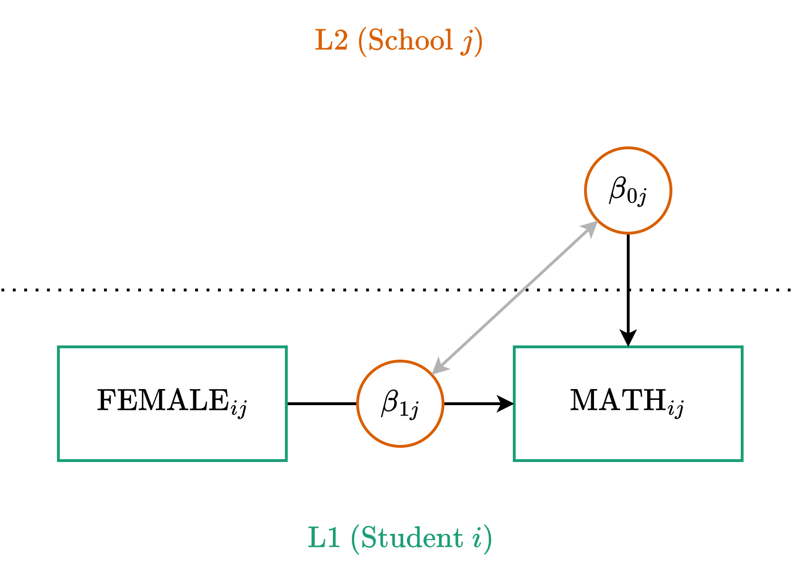

::: {.my-title}
# [Multilevel Modeling]{.blue}
Random Slopes

::: {.my-grey}
[ | CLAS | ]{}<br />
[Jeffrey M. Girard | Lecture ]{}
:::

{.absolute bottom=30 right=0 width="400"}
:::

```{r setup}
#| echo: false
#| message: false

library(tidyverse)
library(easystats)
library(patchwork)
library(here)

source(here("_common.R"))

set_theme(theme_gray(base_size = 20))
```

## Roadmap

::: {.columns .pv4}

::: {.column width="60%"}
1. Conceptual Foundations
    + *Defining Models and Assumptions*

2. Application and Interpretation
    + *Fitting and Visualizing Models*
    
:::

::: {.column .tc .pv4 width="40%"}

:::

:::

# Conceptual Foundations

## Overview

- Just as we estimated a distribution of intercepts across clusters, we can do the same **for lower-level slopes**
    + The [fixed slope]{.b .green} is the mean slope across clusters
    + The [random slopes]{.b .blue} are deviations from this mean
    + The SD of the deviations measures effect heterogeneity

:::{.fragment}
- Random slopes increase the accuracy of the model
    + They enable partial pooling and generalization
    + When $SD\gg0$, it can be misleading to omit them
    
:::

## Visualizing Models

```{r}
#| echo: false

p1 <- ggplot() + 
  geom_abline(
    slope = 2, 
    intercept = 50, 
    color = "black",
    linewidth = 1.5
  ) +
  scale_x_continuous(limits = c(0, 100)) +
  scale_y_continuous(limits = c(0, 300)) +
  labs(x = "x", y = "y", title = "Fixed Intercept\nFixed Slope") +
  theme_bw(base_size = 24) +
  theme(plot.title = element_text(size = 20))

p2 <- ggplot() + 
  geom_abline(slope = 2, intercept = 57, color = "darkblue", linewidth = 1.5) +
  geom_abline(slope = 2, intercept = 30, color = "darkred", linewidth = 1.5) +
  geom_abline(slope = 2, intercept = 15, color = "darkgreen", linewidth = 1.5) +
  geom_abline(slope = 2, intercept = 70, color = "darkorange", linewidth = 1.5) +
  scale_x_continuous(limits = c(0, 100)) +
  scale_y_continuous(limits = c(0, 300)) +
  labs(x = "x", y = NULL, title = "Random Intercepts\nFixed Slope") +
  theme_bw(base_size = 24) +
  theme(
    plot.title = element_text(size = 20),
    axis.text.y = element_blank(), 
    axis.ticks.y = element_blank()
  )

p3 <- ggplot() + 
  geom_abline(slope = 2.2, intercept = 57, color = "darkblue", linewidth = 1.5) +
  geom_abline(slope = 1.3, intercept = 30, color = "darkred", linewidth = 1.5) +
  geom_abline(slope = 3.1, intercept = 15, color = "darkgreen", linewidth = 1.5) +
  geom_abline(slope = -0.2, intercept = 70, color = "darkorange", linewidth = 1.5) +
  scale_x_continuous(limits = c(0, 100)) +
  scale_y_continuous(limits = c(0, 300)) +
  labs(x = "x", y = NULL, title = "Random Intercepts\nRandom Slopes") +
  theme_bw(base_size = 24) +
  theme(
    plot.title = element_text(size = 20),
    axis.text.y = element_blank(), 
    axis.ticks.y = element_blank()
  )

p1 | p2 | p3
```

## Which Predictors Can Have Random Slopes? {.fsmaller}

In a two-level model, we can only estimate random slopes for **Level 1 predictors**.
We cannot estimate random slopes for Level 2 predictors. Why?

:::{.fragment}
**The Prerequisite for a Slope**

* A slope represents a relationship: how much $y$ changes when $x$ changes.
* To calculate a slope *for a specific cluster*, the predictor $x$ must vary *within* that cluster.
* Because Level 1 predictors (like student sex or student study time) vary within schools, we can draw a unique regression line for each school.

:::

## The "Constant" Problem for L2 Predictors {.fsmaller}

Level 2 predictors (like school funding or school type) are measured at the cluster level. 

:::{.fragment}
* These variables are **constants** within a given cluster. 
* Every student in School A has the exact same value for "School Funding."
* If $x$ never changes within a school, we cannot calculate how a change in $x$ affects $y$ within that school. 

:::

:::{.fragment}
* Therefore, in a two-level model, L2 predictors can only have **fixed effects** (the overall effect of the L2 predictor on the outcome across all clusters).
* They cannot have a $u$ deviation because there is no cluster-specific slope to deviate from!

:::

## Review: Fixed Slopes for L1 {.fsmaller}

Let's recall our model with a fixed slope of an L1 predictor.

:::{.tc .b}
Level One (Observation)
:::

$$
y_{ij} = \beta_{0j} + \beta_{1j} x_{ij} + \color{#4daf4a}{e_{ij}}
$$

:::{.tc .b}
Level Two (Cluster)
:::

$$
\begin{align}
\beta_{0j} &= \color{#377eb8}{\gamma_{00}} + \color{#e41a1c}{u_{0j}}\\
\beta_{1j} &= \color{#377eb8}{\gamma_{10}}
\end{align}
$$

We assumed the slope for $x$ was identical across all clusters.

## Adding a Random Slope {.fsmaller}

Now, we let that slope vary across clusters by adding a Level 2 deviation.

:::{.tc .b}
Level One (Observation)
:::

$$
y_{ij} = \beta_{0j} + \beta_{1j} x_{ij} + \color{#4daf4a}{e_{ij}}
$$

:::{.tc .b}
Level Two (Cluster)
:::

$$
\begin{align}
\beta_{0j} &= \color{#377eb8}{\gamma_{00}} + \color{#e41a1c}{u_{0j}} \\
\beta_{1j} &= \color{#377eb8}{\gamma_{10}} + \underbrace{\color{#e41a1c}{u_{1j}}}_{\text{New}}
\end{align}
$$

- $\color{#377eb8}{\gamma_{10}}$ is the **Fixed L1 Slope** (The overall mean slope across all clusters)
- $\color{#e41a1c}{u_{1j}}$ is the **Random Slope Deviation** (How cluster $j$'s slope differs from $\color{#377eb8}{\gamma_{10}}$)

## Decoding the Gammas {.fsmaller}

1. **The first number** says *which Level 1 parameter* is being predicted.
   * `0` = The Intercept $(\beta_{0j})$
   * `1` = The L1 slope $(\beta_{1j})$
2. **The second number** says *which Level 2 predictor* is doing the predicting.
   * `0` = The base parameter (no L2 predictors are predicting this yet)

:::{.fragment}
**Putting it together:**

* $\color{#377eb8}{\gamma_{00}}$ is the baseline effect for the intercept (the [fixed intercept]{.blue}).
* $\color{#377eb8}{\gamma_{10}}$ is the baseline effect for the Level 1 slope (the [fixed slope]{.blue}).

:::

## Reading the Equations {.fsmaller}

$$
y_{ij} = \beta_{0j} + \beta_{1j} x_{ij} + \color{#4daf4a}{e_{ij}}
$$

> $y_{ij}$ is the **outcome** for observation $i$ in cluster $j$ and equals...<br>
> ...the **Cluster Intercept** $(\beta_{0j})$ plus the **Cluster Effect of Predictor $x$** $(\beta_{1j} x_{ij})$ plus the **Observation Deviation** $(\color{#4daf4a}{e_{ij}})$.

:::{.fragment}
$$
\beta_{1j} = \color{#377eb8}{\gamma_{10}} + \color{#e41a1c}{u_{1j}}
$$

> $\beta_{1j}$ is the **Cluster Slope** for cluster $j$ and equals...<br>
> ...the **Fixed Population Slope** $(\color{#377eb8}{\gamma_{10}})$ plus the **Cluster Slope Deviation** $(\color{#e41a1c}{u_{1j}})$. We now allow the effect of $x$ to change across clusters.

:::

## Random Effect Assumptions {.fsmaller}

- With the random intercepts model, we assumed the random intercept deviations were normally distributed.
- Once we add in random slopes, we further assume...
    + The random slope deviations are normally distributed.
    + Their linear combinations are normally distributed.
    + The deviations may be correlated with each other.

:::{.fragment}
- This is captured by the [Multivariate Normal Distribution]{.b .blue}.
:::

## Normal and Multivariate Normal

$$x \sim \text{Normal}(\mu, \sigma)$$

where $\mu$ is the mean and $\sigma$ is the SD (nonnegative)

:::{.fragment .mt4}

$$\begin{bmatrix}x_1\\x_2\end{bmatrix} \sim \text{MVN} \left(\begin{bmatrix}\mu_1\\\mu_2\end{bmatrix}, \begin{bmatrix}\sigma_1 & \\ \rho_{12} & \sigma_2\end{bmatrix}\right)$$

where each variable gets its own $\mu$ and $\sigma$ (as above)<br>
and also each pair of variables gets a correlation $\rho$
:::

## Multilevel Equation Part 2 {.fsmaller}

As we add random effects (e.g., $u_{1j}$), we assume they form a multivariate normal distribution with 0 means and estimated SDs ($\tau_{00}$ and $\tau_{11}$) and correlations ($\tau_{10}$).

:::{.tc .b}
Level One (Observation)
:::

$$
\color{#4daf4a}{e_{ij}} \sim \text{Normal}(0, \color{#4daf4a}{\sigma})
$$

:::{.tc .b}
Level Two (Cluster)
:::

$$
\begin{bmatrix}\color{#e41a1c}{u_{0j}}\\ \color{#e41a1c}{u_{1j}} \end{bmatrix} \sim \text{MVN}\left(\begin{bmatrix}0\\0\end{bmatrix}, \begin{bmatrix}\color{#e41a1c}{\tau_{00}} & \\ 
\color{#e41a1c}{\tau_{10}} & \color{#e41a1c}{\tau_{11}}\end{bmatrix}\right)
$$

## Random Effects Example {.fsmaller}

$$
\begin{align}
e_{ij} &\sim \text{Normal}(0, \sigma) \\
\begin{bmatrix}u_{0j}\\u_{1j}\end{bmatrix} &\sim \text{MVN}\left(\begin{bmatrix}0 \\ 0\end{bmatrix}, \begin{bmatrix}\tau_{00} & \\ \tau_{10} & \tau_{11}\end{bmatrix}\right)
\end{align}
$$

- $\sigma$ = SD of the L1 residuals $(e_{ij})$
- $\tau_{00}$ = SD of the distribution of random intercept deviations $(u_{0j})$
- $\tau_{11}$ = SD of the distribution of random slope deviations $(u_{1j})$
- $\tau_{10}$ = Correlation between the deviations ($u_{0j}$ and $u_{1j}$)

:::{.fragment}
For compactness, we sometimes write $\mathbf{u}_j \sim \text{MVN}(\mathbf{0}, \mathbf{T})$

This is useful because it represents *any* number of $u$ and $\tau$ terms
:::

## Path Diagram



## Mixed (or Reduced) Equation {.fsmaller}

$$
\begin{alignat}{2}
&\text{L1:} \quad & y_{ij} &= \beta_{0j} + \beta_{1j} x_{ij} + \color{#4daf4a}{e_{ij}} \\
&\text{L2:} \quad & \beta_{0j} &= \color{#377eb8}{\gamma_{00}} + \color{#e41a1c}{u_{0j}} \\
&                 & \beta_{1j} &= \color{#377eb8}{\gamma_{10}} + \color{#e41a1c}{u_{1j}}
\end{alignat}
$$

Substitute the L2 equations directly into the L1 equation:

$$
y_{ij} = (\color{#377eb8}{\gamma_{00}} + \color{#e41a1c}{u_{0j}}) + (\color{#377eb8}{\gamma_{10}} + \color{#e41a1c}{u_{1j}}) x_{ij} + \color{#4daf4a}{e_{ij}}
$$

:::{.fragment}
Rearrange to group the fixed and random parts:

$$
y_{ij} = \underbrace{\color{#377eb8}{\gamma_{00}} + \color{#377eb8}{\gamma_{10}} x_{ij}}_{\text{Fixed}} + \underbrace{\color{#e41a1c}{u_{0j}} + \color{#e41a1c}{u_{1j}} x_{ij}}_{\text{Random}} + \color{#4daf4a}{e_{ij}}
$$
:::

## Formula

$$
y_{ij} = \underbrace{\color{#377eb8}{\gamma_{00}} + \color{#377eb8}{\gamma_{10}} x_{ij}}_{\text{Fixed}} + \underbrace{\color{#e41a1c}{u_{0j}} + \color{#e41a1c}{u_{1j}} x_{ij}}_{\text{(Random)}} + \color{#4daf4a}{e_{ij}}
$$

**Generic**

:::{.tc}
`y ~ 1 + x + (1 + x | cluster)`

where the [1 + x]{.blue} part is fixed<br>
and the [(1 + x | cluster)]{.red} part is random
:::

:::{.fragment}
**Example**

:::{.tc}
`math ~ 1 + female + (1 + female | school)`
:::
:::

# Application and Interpretation

## Setup

```{r}
#| message: false
#| replace_path: ["../../data/", ""]

library(tidyverse)
library(easystats)
library(lme4)

dat <- read_csv("../../data/heck2011.csv") |>
  mutate(school = factor(school), female = factor(female))
glimpse(dat)
```

## Fitting the Model {.fsmaller}

```{r fit}
fit <- lmer(
  formula = math ~ 1 + female + (1 + female | school), 
  data = dat,
  REML = TRUE
)
model_parameters(fit)
```

## Interpreting the Fixed Effects {.fsmaller}

- The fixed intercept $(\gamma_{00})$ is...
    + The average male student's math score at the average school.
    + This value is significantly different from zero.

:::{.fragment}
- The fixed slope of female $(\gamma_{10})$ is...
    + The average sex difference at the average school.
    + This value is significantly different from zero.
    + i.e., the female average is lower than the male average.
    
:::

## Interpreting the Random Effects 1 {.fsmaller}

- The random intercept SD $(\tau_{00})$ is...
    + The spread of the random intercept deviations.
    + How much do male averages vary between schools?

:::{.fragment}
- The random slope SD $(\tau_{11})$ is...
    + The spread of the random slope deviations.
    + How much do sex differences vary between schools?
    
:::

## Interpreting the Random Effects 2 {.fsmaller}

- The correlation between deviations $(\tau_{10})$ is...
    + The relationship between $u_{0j}$ and $u_{1j}$.
    + Schools with higher average male math scores tend to have more negative slopes (i.e., stronger sex differences).

:::{.fragment}
- The L1 residual SD $(\sigma)$ is...
    + The spread of the residuals at the lowest model level.
    + The spread of math scores *within* schools (after accounting for sex).
    
:::

## Information Sharing Across Parameters {.fsmaller}

- Partial pooling allows the model to [share information between clusters]{.b .green}
    - Small clusters' estimates are shrunk toward the grand mean

:::{.fragment}
- RE Correlations ($\tau_{10}$) [share information between parameters]{.b .blue}.
    - A cluster's intercept $(u_{0j})$ helps predict its slope $(u_{1j})$.
    - **Example:** If $\tau_{10}$ is strongly negative, schools with high male math scores tend to have larger sex differences.
    - If we observe a new school with a very high intercept but only a few female students, the model "knows" to estimate a more negative slope for that school.

:::

## Do We Care About This Correlation? {.fsmaller}

How do applied researchers actually use $\tau_{10}$? It depends on the context.

:::{.fragment}
**1. Model Accuracy (The Rule)**

* Often, it is just a necessary parameter to make the model more accurate.
* Assuming the correlation is exactly zero is a strong, restrictive assumption.
* Freeing (i.e., estimating) this parameter ensures that our standard errors and fixed effects are estimated correctly.

:::

:::{.fragment}
**2. Substantive Interest (The Exception)**

* Sometimes, the correlation *is* a research question!
* e.g., in longitudinal models, the correlation might answer: Do students who start with higher scores (intercept) learn at a faster rate (slope)? 

:::

## Random Effect Deviations {.fsmaller}

These are called Empirical Bayes (EB) Estimates.

```{r}
estimate_grouplevel(fit, type = "random") # u_0j and u_1j
```

## Random Effect Predictions {.fsmaller}

These are called Best Linear Unbiased Predictions (BLUPs).

```{r}
estimate_grouplevel(fit, type = "total") # beta_0j and beta_1j
```

## Plotting the Fixed Effects

These are estimates for *the average school* in the population.

```{r}
rel <- estimate_relation(fit, by = "female")
plot(rel)
```

## Plotting the Random Effects {.fsmaller}

Because we estimated a *random intercept* and a *random slope*, our model allows the effect of being female on math scores to vary across schools. <br>Notice how the lines (one per cluster/school) are no longer parallel!

```{r}
#| echo: false
#| message: false

library(modelr)

# Generate predictions from our model
dat_pred <- dat |> 
  data_grid(school, female) |> 
  add_predictions(fit)

ggplot(dat, aes(x = female, y = math, color = school)) +
  # The "messy" cluster-specific predictions (alpha lowered slightly to 0.4)
  geom_line(data = dat_pred, aes(y = pred, group = school), alpha = 0.4, linewidth = 1) +
  # The fixed effect population average (thick black line)
  geom_smooth(aes(group = 1), method = "lm", se = FALSE, color = "black", linewidth = 2.5) +
  theme_bw(base_size = 20) +
  labs(x = "Female (0 = Male, 1 = Female)", y = "Predicted Math Score") +
  theme(legend.position = "none")
```

## Visualizing the Slope Distribution {.fsmaller}

Sample-based slope distribution (blue)<br>
Population-level slope estimate (red)

```{r}
#| echo: false 

# Extract just the total slope estimates (beta_1j)
slope_data <- estimate_grouplevel(fit, type = "total") |>
  filter(Parameter == "female1")

ggplot() +
  geom_histogram(
    data = slope_data,
    aes(x = Coefficient, y = after_stat(density)),
    bins = 40,
    fill = "cornflowerblue"
  ) +
  stat_function(
    fun = dnorm, 
    args = list(mean = -1.20, sd = 1.70), 
    color = "firebrick", 
    xlim = c(-7, 5),
    linewidth = 1.5
  ) +
  annotate(
    geom = "label",
    x = -4.5,
    y = 0.4, 
    color = "firebrick",
    size = 8,
    label = "Normal(-1.2, 1.7)"
  ) +
  labs(y = NULL, x = expression(paste("Slope (", beta[1*j], ")"))) +
  theme_bw(base_size = 24) +
  theme(axis.text.y = element_blank(), axis.ticks.y = element_blank())
```

## The Concept of Shrinkage {.fsmaller}

The histogram is narrower than the curve. This is not an error!

* **The Red Curve** represents the estimated *true* distribution of slopes in the population.
* **The Blue Histogram** represents our specific predictions for the schools in this sample.
* **Shrinkage (Partial Pooling):** Because we have uncertainty about each specific school, the model is conservative. It pulls extreme, uncertain estimates toward the overall mean.
* As a result, the spread of our sample predictions is always smaller than the estimated population spread.

## Plotting the RE Correlation

This is a visualization of $u_{0j}$, $u_{1j}$, and $\color{#e41a1c}{\tau_{10}}$.

```{r}
#| echo: false

gl <- 
  estimate_grouplevel(fit, type = "random") |>
  select(Level, Parameter, Coefficient) |> 
  pivot_wider(names_from = Parameter, values_from = Coefficient)

ggplot(gl, aes(x = `(Intercept)`, y = female1)) +
  geom_point(size = 3, alpha = 3/4) +
  geom_smooth(
    method = "lm", 
    se = FALSE,
    formula = y ~ x,
    linewidth = 2,
    color = "firebrick"
  ) +
  labs(x = "Random Intercept Deviations", y = "Random Slope Deviations") +
  theme_bw(base_size = 24)
```
