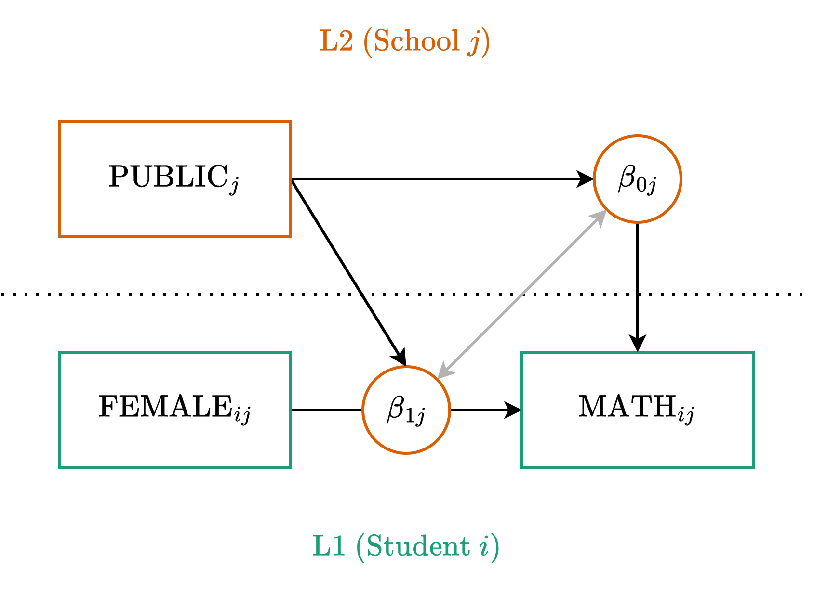

::: {.my-title}
# [Multilevel Modeling]{.blue}
Cross-level Interactions

::: {.my-grey}
[ | CLAS | ]{}<br />
[Jeffrey M. Girard | Lecture ]{}
:::

{.absolute bottom=30 right=0 width="400"}
:::

```{r setup}
#| echo: false
#| message: false

library(tidyverse)
library(easystats)
library(patchwork)
library(here)

source(here("_common.R"))

set_theme(theme_gray(base_size = 20))
```

## Roadmap

::: {.columns .pv4}

::: {.column width="60%"}
1. Conceptual Foundations
    + *Cross-level Interactions*
  
2. Application and Interpretation
    + *Fitting and Interpreting Models*

:::

::: {.column .tc .pv4 width="40%"}

:::

:::

# Conceptual Foundations

## Interactions {.fs80}

- Interaction (moderation) effects allow the effect (i.e., slope) of a predictor to depend on the values of other predictors.
    + We simply estimate a new slope for the [product]{.b .blue} of the predictors.
    + In week 02, we did this for predictors in single-level models.
    
:::{.fragment}
- We also used tools to aid interpretation.
    + Spotlight plots via `estimate_relation()`.
    + Contrast analyses via `estimate_contrasts()`.
    + Simple slopes analysis via `estimate_slopes()`.
    
:::

## Interactions Equation {.fs80}

- Add a slope for the product of two predictors.
    + $y_i = \beta_0 + \beta_1 x_i + \beta_2 z_i + \color{red}{\beta_3 x_i z_i} + e_{i}$

:::{.fragment}
- We can reorganize this equation using algebra.
    + $y_i = \beta_0 + (\beta_1 + \color{red}{\beta_3 z_i}) \color{red}{x_i} + \beta_2 z_i + e_i$
    + $\beta_1$ is the simple slope of $x_i$ and $\beta_3$ is the interaction effect.
    
:::

:::{.fragment}
- The total slope of $x_i$ is now $(\beta_1 + \beta_3 m_i)$.
    + It thus depends on the value of $z_i$.

:::

:::{.fragment}
- Moderation is [symmetrical]{.b .blue}: the slope of $z_i$ also depends on $x_i$.

:::


## Cross-level Interactions {.fs80}

- But what if your predictors are on different levels?

:::{.fragment}
- We can make this work using [cross-level interactions]{.b .blue}.
    + Do L1 relationships depend on L2 predictors?
    + *How do aspects of the cluster (e.g., school) influence<br> within-cluster (e.g., student-level) relationships?*

:::

:::{.fragment}
- This allows us to treat the cluster as a moderator.
    + *[Why]{.b .green} are relationships stronger in some clusters than others?*

:::

## Example Cross-level Questions {.fs80}

- *Is the difference between male and female smiling greater in nations that are more religious (vs. those that are less religious)?*
    + **L1:** $x_{ij}$ = participant's sex, $y_{ij}$ = participant's smiling
    + **L2:** $z_j$ = nation's religiousness

:::{.fragment}
- *Is the relationship between homework and math scores stronger in schools with after-school programs (vs. those without)?*
    + **L1:** $x_{ij}$ = student's homework time, $y_{ij}$ = student's math score
    + **L2:** $z_j$ = school's after-school program status

:::

## Same-Level Interactions {.fs80}

- Multilevel models are not restricted to cross-level interactions.
- You can also include interactions between predictors at the same level.
- **Level 1 Interaction:**
  + Fixed effects: `math ~ 1 + homework * motivation`
- **Random Slopes for L1 Interactions:**
  + Maximal syntax: `+ (1 + homework * motivation | school)`
  + *Warning: This estimates a massive random effects matrix and may cause convergence issues.*
- **Level 2 Interaction:**
  + `math ~ 1 + public * funding + (1 | school)`

## A Note on Predictors Today {.fs80}

1. For today's examples, we are strictly using **categorical (dummy-coded) predictors**.
2. Because dummy codes (0 and 1) have an inherently meaningful zero (the reference group), our model intercepts remain easy to interpret.
3. If we were using *continuous* predictors, we would need to scale them carefully so that their zero values make sense.
4. We will learn how to do that next week (using **centering** and **degrouping**) before we apply cross-level interactions to continuous variables.

## Multilevel Equation Part 1  {.fs80}

- We will accomplish this by adding to the random slope equation

:::{.tc .b}
Level One (Observation)
:::

$$
y_{ij} = \beta_{0j} + \beta_{1j} x_{ij} + \color{#4daf4a}{e_{ij}}
$$

:::{.tc .b}
Level Two (Cluster)
:::

$$
\begin{align}
\beta_{0j} &= \color{#377eb8}{\gamma_{00}} + \color{#377eb8}{\gamma_{01}} z_j + \color{#e41a1c}{u_{0j}} \\
\beta_{1j} &= \color{#377eb8}{\gamma_{10}} + \underbrace{\color{#377eb8}{\gamma_{11}} z_j}_{\text{New}} + \color{#e41a1c}{u_{1j}}
\end{align}
$$

:::{.fragment}
- The slope $\beta_{1j}$ thus now depends on the value of $z_j$

:::

## Multilevel Equation Part 2 {.fs80}

As we add random effects (e.g., $u_{1j}$), we assume they form a multivariate normal distribution with 0 means and estimated SDs (e.g., $\tau_{00}$ and $\tau_{11}$) and correlations (e.g., $\tau_{10}$).

:::{.tc .b}
Level One (Observation)
:::

$$
\color{#4daf4a}{e_{ij}} \sim \text{Normal}(0, \color{#4daf4a}{\sigma})
$$

:::{.tc .b}
Level Two (Cluster)
:::

$$
\begin{bmatrix}\color{#e41a1c}{u_{0j}}\\ \color{#e41a1c}{u_{1j}}\end{bmatrix} \sim \text{MVN}\left(\begin{bmatrix}0\\0\end{bmatrix}, \begin{bmatrix}\color{#e41a1c}{\tau_{00}} & \\ \color{#e41a1c}{\tau_{10}} & \color{#e41a1c}{\tau_{11}}\end{bmatrix}\right)
$$

## Path Diagram




## Mixed (or Reduced) Equation {.fs80}

$$
\begin{alignat}{2}
&\text{L1:} \quad & y_{ij} &= \beta_{0j} + \beta_{1j} x_{ij} + \color{#4daf4a}{e_{ij}} \\
&\text{L2:} \quad & \beta_{0j} &= \color{#377eb8}{\gamma_{00}} + \color{#377eb8}{\gamma_{01}} z_j + \color{#e41a1c}{u_{0j}} \\
&                 & \beta_{1j} &= \color{#377eb8}{\gamma_{10}} + \color{#377eb8}{\gamma_{11}} z_j + \color{#e41a1c}{u_{1j}}
\end{alignat}
$$

Substitute the L2 equations directly into the L1 equation:

$$
y_{ij} = (\color{#377eb8}{\gamma_{00}} + \color{#377eb8}{\gamma_{01}} z_j + \color{#e41a1c}{u_{0j}}) + (\color{#377eb8}{\gamma_{10}} + \color{#377eb8}{\gamma_{11}} z_j + \color{#e41a1c}{u_{1j}}) x_{ij} + \color{#4daf4a}{e_{ij}}
$$

:::{.fragment}
Rearrange to group the fixed and random parts:

$$
y_{ij} = \underbrace{\color{#377eb8}{\gamma_{00}} + \color{#377eb8}{\gamma_{01}} z_j + \color{#377eb8}{\gamma_{10}} x_{ij} + \color{#377eb8}{\gamma_{11}} z_j x_{ij}}_{\text{Fixed}} + \underbrace{\color{#e41a1c}{u_{0j}} + \color{#e41a1c}{u_{1j}} x_{ij}}_{\text{Random}} + \color{#4daf4a}{e_{ij}}
$$
:::

## Formula

$$
y_{ij} = \underbrace{\color{#377eb8}{\gamma_{00}} + \color{#377eb8}{\gamma_{01}} z_j + \color{#377eb8}{\gamma_{10}} x_{ij} + \color{#377eb8}{\gamma_{11}} z_j x_{ij}}_{\text{Fixed}} + \underbrace{\color{#e41a1c}{u_{0j}} + \color{#e41a1c}{u_{1j}} x_{ij}}_{\text{(Random)}} + \color{#4daf4a}{e_{ij}}
$$

**Generic**

:::{.tc}
`y ~ 1 + z * x + (1 + x | cluster)`

where the [1 + x \* z]{.blue} part is fixed<br>
and the [(1 + x | cluster)]{.red} part is random
:::

:::{.fragment}
**Example**

:::{.tc}
`math ~ 1 + public * female + (1 + female | school)`
:::
:::

## The Importance of Random Slopes {.fs80}

- When testing a cross-level interaction, you **must** include the random slope for the Level 1 predictor.
- If you omit the random slope (e.g., using `(1 | school)` instead of `(1 + female | school)`), the model assumes the Level 2 predictor perfectly explains all slope variance.
- This results in standard errors that are too small and severely inflates your Type I error rate.
- **Rule of Thumb:** If a Level 1 predictor $x_{ij}$ interacts with a Level 2 predictor $z_j$, $x_{ij}$ needs a random slope.

# Application and Interpretation

## Setup

```{r}
#| message: false
#| replace_path: ["../../data/", ""]

library(tidyverse)
library(easystats)
library(lme4)

dat <- read_csv("../../data/heck2011.csv") |>
  mutate(school = factor(school), female = factor(female), public = factor(public))
glimpse(dat)
```

## Fitting the Model {.fs80}

```{r fit}
fit <- lmer(math ~ 1 + public * female + (1 + female | school), data = dat)
model_parameters(fit)
```

## Interpreting the Fixed Effects {.fs80}

- The fixed intercept $(\gamma_{00})$ is...
    + The average male student's math score at the average private school (i.e., double reference group)
    + This value is significantly different from zero

:::{.fragment}
- The fixed simple slope of public $(\gamma_{01})$ is...
    + The difference between public and private schools' average intercepts (i.e., average male student's math scores)
    + Not significantly different from zero
    
:::

## Interpreting the Fixed Effects {.fs80}

- The fixed simple slope of female $(\gamma_{10})$ is...
    + The difference between female and male students' average math scores at the average private school
    + Not significantly different from zero

:::{.fragment}
- The fixed public-by-female interaction $(\gamma_{11})$ is...
    + The difference in the female-male sex difference in math scores between the average public and private school
    + Not significantly different from zero
    
:::

## Interpreting the Random Effects 1 {.fs80}

- The random intercept SD $(\tau_{00})$ is...
    + The spread of the random intercept deviations
    + How much do male averages vary between private schools?

:::{.fragment}
- The random slope (of female) SD $(\tau_{11})$ is...
    + The spread of the random slope deviations
    + How much do sex differences vary between schools (after accounting for public status)?
    
:::

## Interpreting the Random Effects 2 {.fs80}

- The correlation between deviations $(\tau_{10})$ is...
    + The relationship between $u_{0j}$ and $u_{1j}$
    + Schools with higher average male math scores tend to have more negative slopes (i.e., stronger sex differences)

:::{.fragment}
- The L1 residual SD $(\sigma)$ is...
    + The spread of the residuals at the lowest model level
    + The spread of students' math scores *within* schools<br>
    (after accounting for sex and public status)

:::


## Random Effect Deviations {.fs80}

These are called Empirical Bayes (EB) Estimates.

```{r}
estimate_grouplevel(fit, type = "random") # u_0j and u_1j
```

## Random Effect Predictions {.fs80}

These are called Best Linear Unbiased Predictions (BLUPs).

```{r}
estimate_grouplevel(fit, type = "total") # beta_0j and beta_1j
```


## Plotting the Fixed Effects

```{r}
rel <- estimate_relation(fit, by = c("female", "public"))
plot(rel)
```

:::{.fs80}
These are estimates for the *average school* in the population.
:::

## Visualizing the Random Slopes {.fs80}

```{r}
#| echo: false
#| message: false

preds <- estimate_expectation(fit, data = dat) |> 
  mutate(school = dat$school, public = dat$public, female = dat$female)

ggplot(
  preds, 
  aes(x = female, y = Predicted, group = school, color = public)
) +
  geom_line(alpha = 0.4, linewidth = 1) +
  theme_bw(base_size = 20) +
  labs(title = "School-Specific Sex Differences")
```

## Contrast Analysis

```{r}
estimate_contrasts(fit, contrast = "female", by = "public")
```

:::{.fs80}
The sex difference is significant in *public* but not in *private* schools.
:::

## Interpretation Part 1 {.fs80}

- Last week, we regressed math on female with random slopes.
    + `math ~ 1 + female + (1 + female | school)`

:::{.fragment}
- Males tended to score higher than females at the average school.
    + $\gamma_{10} = -1.20, p<.001$

:::

:::{.fragment}
- But the sex difference (random slopes) varied between schools.
    + $\tau_{11} = 1.70$

:::

:::{.fragment}
- So some schools had larger sex differences than others.
    + Can we explain this variability with L2 predictors?

:::

## Interpretation Part 2 {.fs80}

- This week, we tested whether a school's sex difference in math scores was significantly related to its public vs private status.

:::{.fragment}
- We did this using a cross-level public-by-female interaction.
    + `math ~ 1 + public * female + (1 + female | school)`

:::

:::{.fragment}
- Sex differences *did not* differ between public and private schools.
    + $\gamma_{11} = -0.81, p=.102$

:::

:::{.callout-warning .fragment}
Don't misinterpret the *simple* slope of female as its *main/partial* effect.
:::

