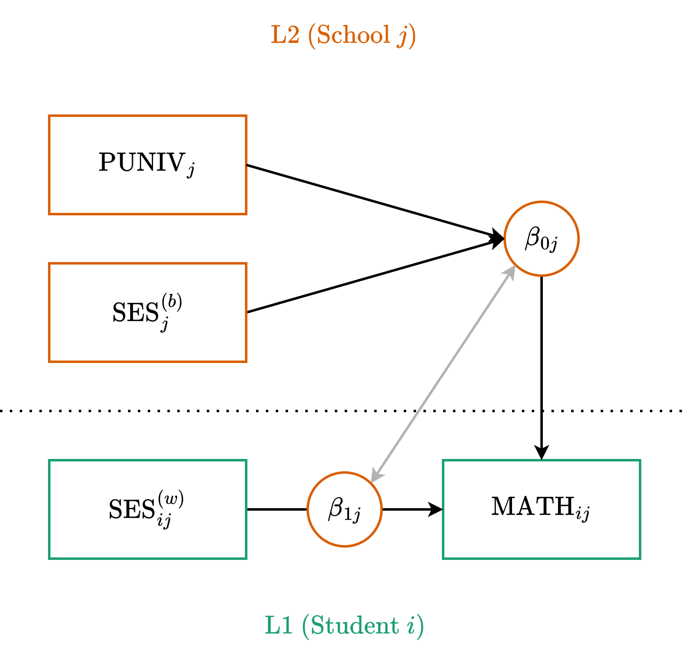
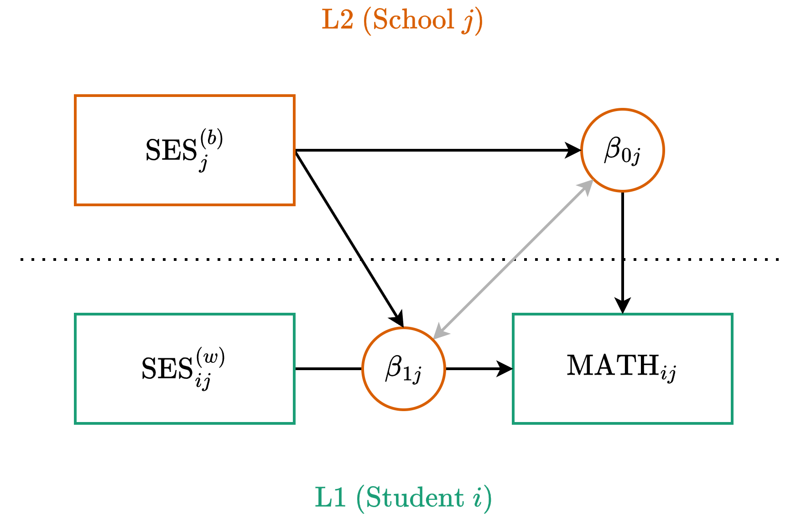

::: {.my-title}
# [Multilevel Modeling]{.blue}
Centering and Degrouping

::: {.my-grey}
[ | CLAS | ]{}<br />
[Jeffrey M. Girard | Lecture ]{}
:::

{.absolute bottom=30 right=0 width="400"}
:::

```{r setup}
#| echo: false
#| message: false

library(tidyverse)
library(easystats)
library(patchwork)
library(here)
library(lme4)

source(here("_common.R"))

set_theme(theme_gray(base_size = 20))
```

## Roadmap

::: {.columns .pv4}

::: {.column width="60%"}
1. Conceptual Foundations
    + *Centering and Standardizing*
    + *Manifest Decomposition*
  
2. Applications and Interpretation
    + *Data Preparation*
    + *Model Building*
    
:::

::: {.column .tc .pv4 width="40%"}

:::

:::

# Conceptual Foundations

## The Need for a Meaningful Zero {.fs80}

- The intercept is the expected value of $y$ when all predictors equal zero
- For categorical predictors, zero is the reference group
- For continuous predictors, a value of zero might be mathematically possible but practically meaningless
    + *What does a prediction at age 0 mean when studying adults?*
    + *If a school cannot have 0 funding, the intercept becomes uninterpretable*

:::{.fragment}
- **The Solution:** We often transform our continuous predictors so that zero represents a meaningful baseline (usually the mean)
- This is particularly valuable when the intercept is of substantive interest or when the variable is involved in interactions

:::

## Centering Level 2 Predictors {.fs80}

- Level 2 predictors represent cluster-level characteristics
- We typically center these using **Grand Mean Centering (GMC)**
    + We subtract the overall (grand) mean from each cluster's score
    + $z_j^{(c)} = z_j - \bar{z}$

:::{.fragment}
- **Interpretation after GMC:**
    + A value of 0 now represents the *average cluster* in the sample
    + Positive values are above and negative values are below average
    + The intercept becomes the expected outcome for an average cluster
    
:::

## Standardizing Level 2 Predictors {.fs80}

- Sometimes we want our predictors to be on a standardized scale
- For Level 2 variables, this process is (or should be) straightforward
    + We subtract the grand mean and divide by the grand standard deviation
    + $z_j^{(s)} = \frac{z_j - \bar{z}}{SD(z)}$

:::{.fragment}
- **Interpretation after Standardizing:**
    + A value of 0 still represents the *average cluster*
    + A value of 1 represents a cluster that is 1 SD above the mean
    + The slope tells us the expected change in $y$ for a 1-SD increase in $z$
    
:::

## The Problem with Level 1 Predictors {.fs80}

- Level 1 predictors like student socioeconomic status (SES) are trickier
- A student's raw SES score actually contains two different pieces of information rolled into one:
    1. **Within-Cluster Variance:** How wealthy is this student compared to their classmates? (The "Frog Pond" effect)
    2. **Between-Cluster Variance:** How wealthy is the school this student attends? (The Compositional effect)

:::{.fragment}
- If we just enter raw L1 SES into the model, the software estimates a single slope that aggressively blends these two effects together
- This is called a **conflated effect** and it can severely bias our results

:::

## Multilevel Fallacies and Paradoxes {.fs70}

If we ignore this and report the conflated effect anyway, we risk falling into:

- **The Ecological Fallacy:** Assuming that relationships observed at the group level (L2) automatically apply to individuals (L1)
- **The Atomistic Fallacy:** Assuming that relationships observed at the individual level (L1) automatically apply to groups (L2)
- **Simpson's Paradox:** The relationship at the aggregate level (L2) is entirely different compared to the relationship at the individual level (L1)

> "If the model does not properly account for the fact that there are different relationships between the predictor and the outcome at different levels, we end up with [a slope that is an uninterpretable blend]{.b .dark-red} of the within-person and between-person slopes." --- *Hamaker \& Muthén (2020)*

## Visualizing Simpson's Paradox

```{r}
#| echo: false
#| message: false
#| fig-align: center
#| fig-height: 5

library(ggplot2)
library(dplyr)

# Synthetic data generation for Simpson's Paradox
set.seed(123)
n_groups <- 5
n_per_group <- 20
df_simpson <- tibble(
  group = rep(1:n_groups, each = n_per_group),
  # Between effect: As group X increases, group Y decreases
  x_between = rep(seq(10, 50, length.out = n_groups), each = n_per_group),
  y_between = -0.5 * x_between, 
  # Within effect: As individual x increases, individual y increases
  x_within = rnorm(n_groups * n_per_group, 0, 3),
  y_within = 0.8 * x_within + rnorm(n_groups * n_per_group, 0, 2),
  # Combined
  x = x_between + x_within,
  y = y_between + y_within
)

ggplot(df_simpson, aes(x, y)) +
  geom_point(aes(color = as.factor(group)), alpha = 0.6) +
  geom_smooth(method = "lm", se = FALSE, color = "black", linetype = "dashed") + # Naive fit
  geom_smooth(aes(group = group, color = as.factor(group)), method = "lm", se = FALSE) + # Cluster fit
  theme_minimal(base_size = 20) +
  theme(legend.position = "none") +
  labs(x = "Physical Activity", y = "Heart Rate", title = "Within (Positive) vs. Between (Negative)")
```

## Manifest Decomposition (Degrouping) {.fs80}

- To fix this, we "degroup" the L1 predictor into two new variables

:::{.fragment}
1. **The Between-Cluster Component (L2)**
    + We calculate the mean of the L1 variable for each cluster
    + $x_j^{(b)}$ represents the school's raw average SES

2. **The Within-Cluster Component (L1)**
    + We subtract the cluster mean from the student's raw score
    + This specific math is called **Cluster Mean Centering (CMC)**
    + $x_{ij}^{(wc)} = x_{ij} - x_j^{(b)}$
    + This represents the student's relative standing *within* their school

:::

## The Magic of Orthogonality {.fs80}

- There is a hidden mathematical benefit to Manifest Decomposition
- Because we calculate $x_{ij}^{(wc)}$ by subtracting the cluster mean, the sum of these within-cluster scores is exactly 0 for every school

:::{.fragment}
- **What this means mathematically:**
    + The between-cluster component $x_j^{(b)}$ and the within-cluster component $x_{ij}^{(wc)}$ are orthogonal, i.e., completely uncorrelated ($r = 0$)
    
:::

:::{.fragment}
- **Why this matters practically:**
    + In regression, correlated predictors compete for explained variance
    + Because our components are orthogonal, they do not compete
    
:::

## Do We Always Need Both? {.fs70}

- What if you only care about the within-cluster effect? Can you just use cluster mean centering (CMC) and ignore the cluster means?

:::{.fragment}
- **Statistically:** Yes. Using only the CMC variable will give you an unbiased estimate of the purely within-cluster slope
:::

:::{.fragment}
- **Practically:** Leaving the cluster means out is usually a missed opportunity!
    + Including the between-cluster component $x_j^{(b)}$ helps explain Level 2 variance and improve the model
    + It allows you to estimate the **between-cluster effect**. This tells you if attending a wealthy school provides a unique benefit *above and beyond* a student's individual wealth
    
:::

## Standardizing Level 1 Predictors {.fs80}

- What if we want to standardize a Level 1 predictor?
- We must be careful not to re-conflate the variance we just separated
- **The Rule:** Standardize Level 1 variables *only after* degrouping them

:::{.fragment}
- The **between-cluster component** $x_j^{(bs)}$ is standardized using the mean and SD of the unique cluster means
- The **within-cluster component** $x_{ij}^{(ws)}$ is standardized using a mean of 0 and the pooled within-cluster SD
- This ensures a 1-unit change accurately represents a 1-SD shift at the correct level of analysis
:::

## What About Standardizing Y? {.fs70}

- In standard regression (OLS), we often standardize both predictors and the outcome to get fully standardized coefficients
- In multilevel modeling, we typically **only standardize the predictors** and leave the outcome ($y$) in its raw metric

:::{.fragment}
**Why do we leave Y raw?**

- The variability of $y$ is partitioned across multiple levels (e.g., within-cluster $\sigma$ and between-cluster $\tau_{00}$)
- Standardizing $y$ globally distorts this variance partitioning and makes the random effects very difficult to interpret
- By only standardizing our predictors, we get "partially standardized" slopes: *A 1-SD increase in the predictor leads to a $\gamma$ unit change in the raw outcome*
:::

## Best Practice Recommendations {.fs70}

Here is a summary checklist for continuous variables in multilevel models.

1. **The Outcome Variable:** Leave the outcome $(y)$ in its raw, uncentered metric so variance components remain interpretable
2. **Meaningful Intercepts:** Transform continuous predictors when 0 is not naturally meaningful or when the variable is involved in interactions
3. **Level 2 Predictors:** Grand mean center or standardize directly
4. **Level 1 Predictors:** Degroup into between-cluster and within-cluster components
5. **Standardizing L1:** Degroup first, then standardize the resulting components independently
6. **Random Slopes:** If you are testing cross-level or compositional interactions, the Level 1 component must have a random slope

# Data Preparation

## The Weighting Problem {.fs80}

When we work with Level 1 data (one row per student), Level 2 variables (like school funding or proportion going to university) are repeated for every student in that school

:::{.fragment}
If we simply run `center(puniv)` on this dataset, the software calculates the mean across all *rows*, not all *schools*
:::

:::{.fragment}
**Why is this a problem?**

- It weights the grand mean and standard deviation by cluster size
- A school with 1,000 students pulls the mean 10 times harder than a school with 100 students!
- The resulting variables are biased toward larger clusters and no longer represent the typical school

:::

## The "Split, Transform, Join" Workflow {.fs80}

To safely center and standardize our variables without size bias, we need to explicitly separate our data by level

:::{.fragment}
1. **Split:** Create a dataset with exactly one row per cluster (Level 2)
2. **Transform (L2):** Safely apply Grand Mean Centering and Standardizing to this unweighted data
3. **Join:** Merge these perfect Level 2 variables back into the Level 1 variables
4. **Transform (L1):** Safely apply Cluster Mean Centering and Standardizing to the Level 1 variables
:::

## Step 1: Prep the Level 2 Data

::: {.fs80}
First, we load our data and create a Level 2 dataset. We grab our L2 predictor (*puniv*) and calculate the raw cluster mean for our L1 predictor (*ses_b*)
:::

```{r}
#| message: false
#| replace_path: ["../../data/", ""]

library(tidyverse)

dat_raw <- read_csv("../../data/heck2011.csv") |>
  mutate(school = factor(school))

dat_l2 <- dat_raw |>
  summarize(
    .by = school,
    puniv = first(puniv), 
    ses_b = mean(ses, na.rm = TRUE)
  ) 
```

:::{.fragment .fs80}
Because this dataset has exactly one row per school, we can safely center and standardize without weighting biases!
:::

## Step 1: Transform the Level 2 Data

```{r}
dat_l2 <- dat_l2 |>
  # Apply Grand Mean Centering and Standardizing to L2
  mutate(
    puniv_c = center(puniv),
    ses_bc  = center(ses_b),
    puniv_s = standardize(puniv),
    ses_bs  = standardize(ses_b)
  )
glimpse(dat_l2)
```

## Step 2: Prep the Level 1 Data

:::{.fs80}
Next, take the original L1 data and join our new L2 data into it 
:::

```{r}
dat <- dat_raw |>
  # Drop the raw L2 variable to avoid duplicates during the join
  select(-puniv) |> 
  left_join(dat_l2, by = "school")
```

:::{.fragment .fs80}
Finally, we calculate the within-cluster component. Because cluster-mean-centered scores always sum to zero within a cluster, `standardize()` automatically calculates the correct pooled within-cluster standard deviation.
:::

## Step 2: Transform the Level 1 Data

```{r}
dat <- dat |>
  mutate(
    ses_wc = ses - ses_b, 
    ses_ws = standardize(ses_wc) 
  )
dat |> select(school, ses_b, ses, ses_wc, ses_ws) |> glimpse()
```

# Model Building

## Model 1: Establishing Main Effects {.fs80}

- Let's predict math scores using student wealth *and* school wealth

:::{.fragment}
- **The Predictors:**
    + `ses_wc`: The student's relative wealth compared to their peers
    + `ses_bc`: The school's overall average wealth
    + `puniv_c`: The school's university attendance rate (as an L2 covariate)
    
:::

:::{.fragment}
- **The Goal:** 
    + By including both SES components, we avoid the conflated effect problem and can tease apart the unique effects of both components
    + We will also compare the use of centered and standardized predictors
    
:::


## Model 1C: Path Diagram



## Model 1C: Centered Equations {.fs80}

:::{.tc .b}
Level One (Observation)
:::

$$
y_{ij} = \beta_{0j} + \beta_{1j} x_{ij}^{(wc)} + \color{#4daf4a}{e_{ij}}
$$

:::{.tc .b}
Level Two (Cluster)
:::

$$
\begin{align}
\beta_{0j} &= \color{#377eb8}{\gamma_{00}} + \color{#377eb8}{\gamma_{01}} x_j^{(bc)} + \color{#377eb8}{\gamma_{02}} z_j^{(c)} + \color{#e41a1c}{u_{0j}} \\
\beta_{1j} &= \color{#377eb8}{\gamma_{10}} + \color{#e41a1c}{u_{1j}}
\end{align}
$$

:::{.fragment}
- $\gamma_{10}$ is the fixed within-cluster effect
- $\gamma_{01}$ is the fixed between-cluster effect
- $\gamma_{02}$ is the fixed effect of our L2 covariate
:::

## Model 1C: Mixed Equation {.fs80}

Substitute the L2 equations directly into the L1 equation:

$$
y_{ij} = \underbrace{\color{#377eb8}{\gamma_{00}} + \color{#377eb8}{\gamma_{01}} x_j^{(bc)} + \color{#377eb8}{\gamma_{02}} z_j^{(c)} + \color{#377eb8}{\gamma_{10}} x_{ij}^{(wc)}}_{\text{Fixed}} + \underbrace{\color{#e41a1c}{u_{0j}} + \color{#e41a1c}{u_{1j}} x_{ij}^{(wc)}}_{\text{Random}} + \color{#4daf4a}{e_{ij}}
$$

**Formula Syntax**

:::{.tc}
`y ~ 1 + x_between + x_within + z_l2 + (1 + x_within | cluster)`
:::

:::{.fragment}
**Our Example**

:::{.tc}
`math ~ 1 + ses_bc + ses_wc + puniv_c + (1 + ses_wc | school)`
:::
:::

## Model 1C: Fitting the Model

```{r}
fit1c <- lmer(
  math ~ 1 + ses_bc + ses_wc + puniv_c + (1 + ses_wc | school), 
  data = dat
)
model_parameters(fit1c, effects = "fixed")
```

## Model 1C: Interpretation {.fs80}

Because our predictors are centered, the coefficients represent changes in raw math points for a 1-unit increase in the raw predictor

- **Intercept (57.66):** The expected math score for an average student (*ses_wc*\ =\ 0) at an average school (*ses_bc*\ =\ 0 and *puniv_c*\ =\ 0)

- **ses_bc (5.60):** Controlling for student wealth and university attendance, a 1-unit increase in a school's overall SES is associated with a 5.60 point increase in math

- **ses_wc (3.19):** Controlling for school factors, a 1-unit increase in a student's relative wealth is associated with a 3.19 point increase in math

- **puniv_c (1.52):** Controlling for school and student SES, a 1-unit increase in the university attendance rate (e.g., from 10% to 11%) is associated with a 1.52 point increase in math

## Model 1S: Standardized Equations {.fs80}

The structure remains identical, but we swap in the **standardized** components 

:::{.tc .b}
Level One (Observation)
:::

$$
y_{ij} = \beta_{0j} + \beta_{1j} x_{ij}^{(ws)} + \color{#4daf4a}{e_{ij}}
$$

:::{.tc .b}
Level Two (Cluster)
:::

$$
\begin{align}
\beta_{0j} &= \color{#377eb8}{\gamma_{00}} + \color{#377eb8}{\gamma_{01}} x_j^{(bs)} + \color{#377eb8}{\gamma_{02}} z_j^{(s)} + \color{#e41a1c}{u_{0j}} \\
\beta_{1j} &= \color{#377eb8}{\gamma_{10}} + \color{#e41a1c}{u_{1j}}
\end{align}
$$

:::{.fragment}
Because our inputs are standardized, the resulting gammas will tell us the expected change in math points for a **1-SD** increase in the predictors. 
:::

## Model 1S: The Standardized Model

```{r}
fit1s <- lmer(
  math ~ 1 + ses_bs + ses_ws + puniv_s + (1 + ses_ws | school), 
  data = dat
)
model_parameters(fit1s, effects = "fixed")
```

## Model 1S: Interpretation {.fs80}

Because our predictors are standardized and our outcome is raw, the coefficients represent changes in raw math points for a **1-SD** increase.

- **Intercept (57.66):** The expected math score for an average student (*ses_ws*\ =\ 0) at an average school (*ses_bs*\ =\ 0 and *puniv_s*\ =\ 0)
- **ses_bs (2.73):** Controlling for student wealth and university attendance, a 1-SD increase in a school's overall SES is associated with a 2.73 point increase in math
- **ses_ws (1.93):** Controlling for school factors, a 1-SD increase in a student's relative wealth is associated with a 1.93 point increase in math
- **puniv_s (0.42):** Controlling for school and student SES, a 1-SD increase in university attendance rate is associated with a 0.42 point increase in math


## Model 2: Moving to Moderation {.fs70}

- In Model 1, we established the main effects. We know that being relatively wealthy is beneficial (the within-cluster effect) and attending a wealthy school is beneficial (the between-cluster effect)

:::{.fragment}
- **A New Question:** Does the *benefit* of relative wealth depend on the overall wealth of the school?
    + *In other words, does being the richest kid in school matter more if you are at a poor school versus a wealthy school?*
    
:::

:::{.fragment}
- To test this, we can allow the school's average SES to moderate the slope of the student's relative SES (for simplicity, we will also drop *puniv* here)
- Because both the predictor and the moderator originate from the same variable, this is often called a **compositional interaction** or **self-moderation**

:::

## Model 2C: Path Diagram



## Model 2C: Centered Equations {.fs80}

:::{.tc .b}
Level One (Observation)
:::

$$
y_{ij} = \beta_{0j} + \beta_{1j} x_{ij}^{(wc)} + \color{#4daf4a}{e_{ij}}
$$

:::{.tc .b}
Level Two (Cluster)
:::

$$
\begin{align}
\beta_{0j} &= \color{#377eb8}{\gamma_{00}} + \color{#377eb8}{\gamma_{01}} x_j^{(bc)} + \color{#e41a1c}{u_{0j}} \\
\beta_{1j} &= \color{#377eb8}{\gamma_{10}} + \underbrace{\color{#377eb8}{\gamma_{11}} x_j^{(bc)}}_{\text{New}} + \color{#e41a1c}{u_{1j}}
\end{align}
$$

## Model 2C: Mixed Equation {.fs80}

Substitute the L2 equations directly into the L1 equation:

$$
y_{ij} = \underbrace{\color{#377eb8}{\gamma_{00}} + \color{#377eb8}{\gamma_{01}} x_j^{(bc)} + \color{#377eb8}{\gamma_{10}} x_{ij}^{(wc)} + \color{#377eb8}{\gamma_{11}} x_j^{(bc)} x_{ij}^{(wc)}}_{\text{Fixed}} + \dots
$$
$$
\dots + \underbrace{\color{#e41a1c}{u_{0j}} + \color{#e41a1c}{u_{1j}} x_{ij}^{(wc)}}_{\text{Random}} + \color{#4daf4a}{e_{ij}}
$$

**Formula Syntax**

:::{.tc}
`y ~ 1 + x_between * x_within + (1 + x_within | cluster)`
:::

:::{.fragment}
**Our Example**

:::{.tc}
`math ~ 1 + ses_bc * ses_wc + (1 + ses_wc | school)`
:::
:::

## Model 2C: Centered Interaction


```{r}
fit2c <- lmer(
  math ~ 1 + ses_bc * ses_wc + (1 + ses_wc | school), 
  data = dat
)
model_parameters(fit2c, effects = "fixed")
```

## Model 2C: Interpretation {.fs80}

- **Intercept (57.67):** The expected math score for an average-SES student (*ses_wc* = 0) at an average-SES school (*ses_bc* = 0)
- **ses_bc (5.88):** For a student with average relative wealth, a 1-unit increase in their school's average SES is associated with a 5.88 point increase in math
- **ses_wc (3.17):** At an average-SES school, a 1-unit increase in a student's relative wealth is associated with a 3.17 point increase in math
- **ses_bc $\times$ ses_wc (--0.29):** The interaction is near zero and non-significant. The benefit of being relatively wealthy compared to your peers operates similarly regardless of whether you attend a poor school or a wealthy school

## Model 2C: Visualizing the Interaction

```{r}
#| fig-width: 10
#| fig-height: 4.5

plot(estimate_relation(fit2c, by = c("ses_wc", "ses_bc=[quartiles]")))
```

## Model 2C: Simple Slopes Analysis

```{r}
estimate_slopes(fit2c, trend = "ses_wc", by = "ses_bc=[quartiles]")
```

:::{.fragment .fs80}
The positive effect of relative SES remains stable and significant across schools with low, medium, and high average SES
:::

## Model 2S: Standardized Equations {.fs80}

Finally, we compare with standardized (s) predictors

:::{.tc .b}
Level One (Observation)
:::

$$
y_{ij} = \beta_{0j} + \beta_{1j} x_{ij}^{(ws)} + \color{#4daf4a}{e_{ij}}
$$

:::{.tc .b}
Level Two (Cluster)
:::

$$
\begin{align}
\beta_{0j} &= \color{#377eb8}{\gamma_{00}} + \color{#377eb8}{\gamma_{01}} x_j^{(bs)} + \color{#e41a1c}{u_{0j}} \\
\beta_{1j} &= \color{#377eb8}{\gamma_{10}} + \color{#377eb8}{\gamma_{11}} x_j^{(bs)} + \color{#e41a1c}{u_{1j}}
\end{align}
$$

## Model 2S: Standardized Interaction

```{r}
fit2s <- lmer(
  math ~ 1 + ses_bs * ses_ws + (1 + ses_ws | school), 
  data = dat
)
model_parameters(fit2s, effects = "fixed")
```

## Model 2S: Interpretation {.fs80}

Because our predictors are standardized and our outcome is raw, the coefficients represent changes in raw math points for a **1-SD** increase

- **Intercept (57.67):** The expected math score for an average student (*ses_ws*\ =\ 0) at an average school (*ses_bs*\ =\ 0)
- **ses_bs (2.86):** For a student with average relative wealth, a 1-SD increase in their school's average SES is associated with a 2.86 point increase in math
- **ses_ws (1.92):** At an average-SES school, a 1-SD increase in a student's relative wealth is associated with a 1.92 point increase in math
- **ses_bs $\times$ ses_ws (--0.08):** For every 1-SD increase in a school's average SES, the standardized slope of relative SES changes by -0.08. This is non-significant, meaning the lines are practically parallel
