::: {.my-title}
# [Multilevel Modeling]{.blue}
Model Comparison

::: {.my-grey}
[ | CLAS | ]{}<br />
[Jeffrey M. Girard | Lecture ]{}
:::

{.absolute bottom=30 right=0 width="400"}
:::

```{r setup}
#| echo: false
#| message: false

library(tidyverse)
library(easystats)
library(patchwork)
library(here)
library(glmmTMB)

source(here("_common.R"))

set_theme(theme_gray(base_size = 20))
```

## Roadmap

::: {.columns .pv4}

::: {.column width="60%"}
1. Model Comparison
    + *Deviance and Nesting*
    + *LRT and Information Criteria*
  
2. Modeling Approach
    + *Simple to Complex*
    + *Sequential Comparisons*
    
:::

::: {.column .tc .pv4 width="40%"}

:::

:::

# Model Comparison

## Deviance

To compare models, we need to quantify their fit to the data

The [deviance]{.b .blue} $(D)$ metric has some nice properties for this

:::{.fragment}
It is a simple transformation of the model's likelihood $(\mathcal{L})$

$$D = -2\ell=-2 \log(\mathcal{L})$$

:::{.tc}
[Lower deviance = Better fit]{.b .green}<br />
(e.g., $1000$ is better than $1552$)<br />
(e.g., $-52$ is better than $-30$)
:::
:::

## Nesting

::: {.fs80}
- We can statistically compare *nested* models using their deviances

:::{.fragment}
- If two models are nested, that means a more specific model can be derived from a more general model by removing fixed effects
    + ✅ Adding fixed slopes (nested)
    + ✅ Adding random slopes (nested)
    + ✅ Adding random intercepts (nested)
    + ❌ Swapping predictors (not nested)
    + ❌ Swapping clustering variables  (not nested)
    + ❌❌ Swapping outcome variables (not comparable)

:::
:::

## The Nesting Logic

- **Definition**: Model A is nested in Model B if A is just B with some parts "turned off" (fixed at zero).
- **Visualizing Nesting**: Think of Russian Dolls. A smaller model must fit entirely inside the larger one.
- **The Rule**: You can add or remove terms, but you cannot swap them.
    - ✅  <code>y ~ 1 + x</code> is nested in <code>y ~ 1 + x <span class="light-green b">+ z</span></code>
    - ❌  <code>y ~ 1 + x</code> is **not** nested in <code>y ~ 1 + <span class="light-red b">z</span></code>

## Nesting Examples {.fs90}

1. ✅ Adding a fixed slope
    + <code>y ~ 1 + (1 | c)</code> to <code>y ~ 1 <span class="light-green b">+ x</span> + (1 | c)</code>

:::{.fragment}
2. ✅ Adding a random slope
    + <code>y ~ 1 + x + (1 | c)</code> to <code>y ~ 1 + x + (1 <span class="light-green b">+ x</span> | c)</code>

:::
:::{.fragment}
3. ✅ Adding random intercepts
    + <code>y ~ 1 + x</code> to <code>y ~ 1 + x <span class="light-green b">+ (1 | c)</span></code>

:::

## Non-Nesting Examples {.fs90}

4. ❌ Swapping predictors
    + <code>y ~ 1 + x + (1 | c)</code> to <code>y ~ 1 + <span class="light-red b">z</span> + (1 | c)</code>

:::{.fragment}
5. ❌ Swapping clustering variables
    + <code>y ~ 1 + (1 | c)</code> to <code>y ~ 1 + (1 | <span class="light-red b">g</span>)</code>

:::
:::{.fragment}
6. ❌❌ Swapping outcome variables
    + <code>y ~ 1 + (1 | c)</code> to <code><span class="light-red b">q</span> ~ 1 + (1 | c)</code>

:::

## Likelihood Ratio Test

- The LRT compares two nested models' deviances

$$\Delta D = D_{\text{general}}-D_{\text{specific}}$$ 

- It is a chi-squared test with degrees of freedom equal to the difference in the two models' number of parameters $(q)$

$$\Delta D \sim \chi^2(\text{df}=q_{\text{general}}-q_{\text{specific}})$$


## Likelihood Ratio Test {.fs90}

- Several important notes about the LRT
    + It can only compare ***nested*** models
    + The compared models should be fit with ML
    + We can use `test_lrt(model1, model2, ...)`
    
:::{.fragment}
- Interpreting the results
    + A significant result means $\Delta D \neq 0$
    + The model with *lower* deviance is better
    + We can examine them with `get_deviance(model1)`
    
:::


## Data Preparation

```{r}
#| message: false
#| replace_path: ["../../data/", ""]

library(tidyverse)
library(glmmTMB)
library(easystats)

heck2011 <- read_csv("../../data/heck2011.csv", show_col_types = FALSE)
glimpse(heck2011)
```

## Why glmmTMB?

- **Familiar Syntax**: It uses the same `formula`, `data`, and `REML` arguments as `lmer()` (defaults to REML = FALSE)
- **Flexibility**: Unlike `lmer()`, it can fit models with no random effects, which will let us compare models with and without
- **Better Convergence**: It is often more robust when models become complex (will be used a lot for troubleshooting)

::: {.fragment .fs80 .mt1}
**Note**: GLMM stands for Generalized Linear Mixed Modeling, which is multilevel modeling for non-normal outcomes, and TMB stands for Template Model Builder, which is the underlying software that powers the package
:::

## Do we need a random intercept?

```{r  fit0}
m0 <- glmmTMB(math ~ 1, heck2011)
m1 <- glmmTMB(math ~ 1 + (1 | school), heck2011)
c(m0 = get_deviance(m0), m1 = get_deviance(m1))
```

:::{.fragment}
```{r lrt01}
test_lrt(m0, m1)
```

::: {.fs80}
- m1 has significantly better fit than m0, so we need the random intercept
:::
:::

## Do we need a fixed slope?

```{r}
m1 <- glmmTMB(math ~ 1 + (1 | school), heck2011)
m2 <- glmmTMB(math ~ 1 + female + (1 | school), heck2011)
c(m1 = get_deviance(m1), m2 = get_deviance(m2))
```

:::{.fragment}
```{r}
test_lrt(m1, m2)
```

::: {.fs80}
- m2 has significantly better fit than m1, so we need the fixed slope
:::
:::

## Do we need a random slope?

```{r}
m2 <- glmmTMB(math ~ 1 + female + (1 | school), heck2011)
m3 <- glmmTMB(math ~ 1 + female + (1 + female | school), heck2011)
c(m2 = get_deviance(m2), m3 = get_deviance(m3))
```

:::{.fragment}
```{r}
test_lrt(m2, m3)
```

::: {.fs80}
- m3 was not sig. better than m2, so we don't need the random slope
:::
:::


## Trying Non-nested Models

```{r}
m4 <- glmmTMB(math ~ 1 + public + (1 | school), heck2011)
m5 <- glmmTMB(math ~ 1 + puniv + (1 | school), heck2011)
```

:::{.fragment}
```{r}
#| error: true

test_lrt(m4, m5)
```

:::


## Information Criteria {.fs70}

- We use "information criteria" to compare non-nested models
    + They are only meaningful when the outcome is the same
    + Lower is better but the comparisons are only relative
    + $\Delta\text{IC}$: 0--2 = small, 2--10 = medium, 10+ = large difference

$$
\text{AIC} = D + 2q \quad\quad\quad
\text{BIC} = D + q \log(n)
$$

- Two popular ICs are the Akaike (AIC) and Bayesian (BIC)
    + Both metrics penalize the model for adding parameters $(q)$
    + BIC is more "conservative" than AIC (i.e., adds a larger penalty)


## IC for Non-nested Models

```{r}
compare_performance(
  m4, # math ~ 1 + public + (1 | school)
  m5, # math ~ 1 + puniv + (1 | school)
  metrics = c("AIC", "BIC")
)
```

- Thus, *puniv* is a better predictor of *math* than *public* is

- The probability that fit5 is better than fit4 is 99.9\%

## IC for Nested Models

```{r}
compare_performance(
  m0, # math ~ 1
  m1, # math ~ 1 + (1 | school)
  m2, # math ~ 1 + female + (1 | school)
  m3, # math ~ 1 + female + (1 + female | school)
  metrics = c("AIC", "BIC")
)
```

:::{.fs80}
- AIC prefers the complex m3 (66.7\%), BIC prefers the simpler m2 (99.8\%)
:::

# Modeling Approach

## Bottom-up Strategy

::: {.fs80}
- Start with the simplest model and build up, one step at a time

- Test whether each step is a significant improvement

1. Fit a null model (intercepts only)

2. Add all L1 predictors (fixed slopes only)

3. Add all L2 predictors (fixed slopes)

4. Add L1 random slopes one at a time 🔄

5. Add cross-level interactions one at a time 🔄
:::

## Example

```{r dat}
dat <-
  heck2011 |> 
  degroup(select = "ses", by = "school") |>
  mutate(female = factor(female), public = factor(public)) |> 
  standardize()
glimpse(dat)
```


## Step 1

Fit null model and calculate unconditional ICC

```{r step1}
step1 <- glmmTMB(
  math ~ 1 + (1 | school),
  data = dat,
  REML = FALSE
)
icc(step1)
```

:::{.fragment}
- 14\% of math score variance is between schools
:::

## Step 2

Add fixed slopes for all L1 predictors

```{r step2}
step2 <- glmmTMB(
  math ~ 1 + female + ses_within + (1 | school),
  data = dat,
  REML = FALSE
)
test_lrt(step1, step2)
```

:::{.fragment}
- Including the L1 predictors is helpful
:::

## Step 3 {.fs90}

Add fixed slopes for all L2 predictors

```{r step3}
step3 <- glmmTMB(
  math ~ 1 + female + ses_within + 
    ses_between + public + puniv + (1 | school),
  data = dat,
  REML = FALSE
)
test_lrt(step2, step3)
```

:::{.fragment}
- Including the L2 predictors is helpful
:::

## Step 4a {.fs90}

Add first random slope (for female)

```{r step4a}
step4a <- glmmTMB(
  math ~ 1 + female + ses_within + 
    ses_between + public + puniv + (1 + female | school),
  data = dat,
  REML = FALSE
)
test_lrt(step3, step4a)
```

:::{.fragment}
- Making the female slope random is not helpful
:::

## Step 4b {.fs90}

Add second random slope (for ses_within)

```{r step4b}
step4b <- glmmTMB(
  math ~ 1 + female + ses_within + 
    ses_between + public + puniv + (1 + ses_within | school),
  data = dat,
  REML = FALSE
)
test_lrt(step3, step4b)
```

:::{.fragment}
- Making the ses_within slope random is helpful
:::

## Step 5a {.fs90}

Add the cross-level interaction of ses_within and public

```{r step5a}
step5a <- glmmTMB(
  math ~ 1 + female + ses_within * public +
    ses_between + public + puniv + 
    (1 + ses_within | school),
  data = dat,
  REML = FALSE
)
test_lrt(step4b, step5a)
```

:::{.fragment}
- Including this interaction may not be necessary
:::

## Step 5b {.fs90}

Add the cross-level interaction of ses_within and puniv

```{r step5b}
step5b <- glmmTMB(
  math ~ 1 + female + ses_within * puniv +
    ses_between + public + puniv + 
    (1 + ses_within | school),
  data = dat,
  REML = FALSE
)
test_lrt(step4b, step5b)
```

:::{.fragment}
- Including this interaction is not helpful
:::

## Summary of LRT Results



::: {.fs80}
- LRT favors the model from Step 4b, so I would usually choose that
- Or, if testing an SES interaction was my goal, I would use 5a or 5b
:::

## Final Model (According to LRT)

```{r}
model_parameters(step4b, effects = "fixed")
```

## IC Model Comparison {.fs90}

```{r}
compare_performance(
  step1, step2, step3, step4a, 
  step4b, step5a, step5b,
  metrics = c("AIC", "BIC")
)
```

::: {.fs80}
- So AIC prefers the complex Model 5a and BIC prefers the simpler Model 3
:::

## Which Metric Should I Trust? {.fs70}

When AIC, BIC, and LRT disagree, consider your research goal:

1. **LRT**: Best for testing a specific "yes/no" hypothesis about a parameter
2. **AIC**: Best if you want the most accurate prediction (favors complexity)
3. **BIC**: Best for building simple, clean theory (favors parsimony)

::: {.callout-tip}
If BIC prefers the simpler model and AIC prefers the complex one, the "extra" effects are likely very small
:::
