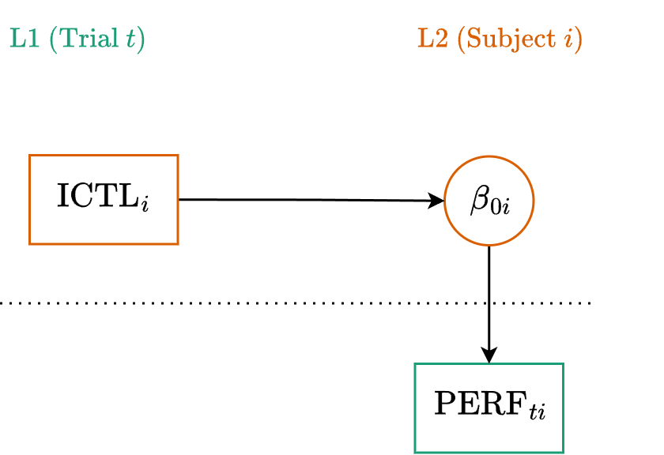
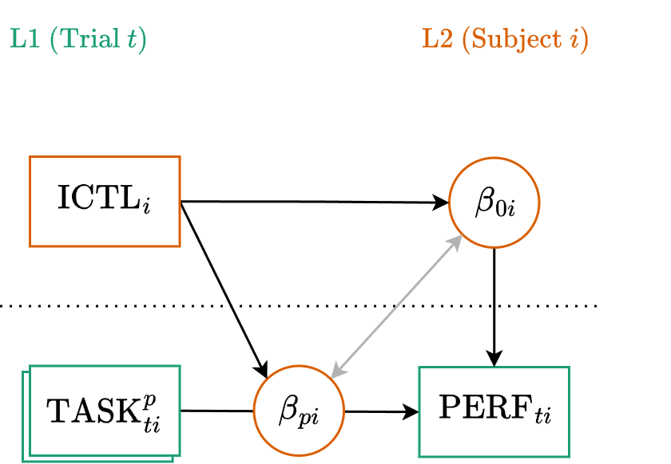

::: {.my-title}
# [Multilevel Modeling]{.blue}
Repeated Measures

::: {.my-grey}
[ | CLAS | ]{}<br />
[Jeffrey M. Girard | Lecture ]{}
:::

{.absolute bottom=30 right=0 width="400"}
:::

```{r setup}
#| echo: false
#| message: false

library(tidyverse)
library(easystats)
library(patchwork)
library(here)
library(glmmTMB)

source(here("_common.R"))

set_theme(theme_gray(base_size = 20))

options(width = 80)
```

## Roadmap

::: {.columns .pv4}

::: {.column width="60%"}
1. Within-Person Variance
    + *Trial-level Analysis*
    + *Task-by-Person Effects*
  
2. The Structure of Error
    + *Autocorrelation Tests*
    + *Drift vs. White Noise*
    
:::

::: {.column .tc .pv4 width="40%"}

:::

:::

# Repeated Measures

## Overview

- Repeated measures designs are ubiquitous in social science
    + e.g., completing multiple trials of a task
    + e.g., responding to within-person experimental conditions
    + e.g., answering daily diary surveys
    
:::{.fragment}
- These are perfect applications for multilevel modeling
    + Instead of individuals (L1) within larger units (L2)...
    + ...we have observations (L1) within individuals (L2)

:::

## The Base Example

**Main Variables**

- Outcomes = `performance` (numeric score on a trial)
- L2 Predictor = `icontrol` (trait inhibitory control)

**Research Question**

- Does a person's trait *inhibitory control* predict their average *intellectual performance* across multiple trials?

## Example Data

```{r}
#| message: false
#| replace_path: ["../../data/", ""]

library(tidyverse)
library(glmmTMB)
library(easystats)

intell <- read_csv("../../data/intell_sim.csv")
glimpse(intell)
```

:::{.fsmaller}
Each of 150 (fake) subjects completed 12 experimental trials.
:::

## The Aggregation Approach

:::{.fsmaller}
Historically, researchers would simply average the L1 observations to create a single L2 score for each person, then run a standard linear regression.
:::

```{r}
# Collapse L1 to L2
intell_avg <- 
  intell |> 
  summarize(
    .by = subject,
    icontrol = first(icontrol),
    perf_avg = mean(performance, na.rm = TRUE)
  )
# Fit single-level model
fit_avg <- lm(perf_avg ~ icontrol, data = intell_avg)
model_parameters(fit_avg)
```

## Why Multilevel is Better

:::{.fsmaller}
- **Information Loss:** Averaging collapses all L1 variance into a single point.
    + We lose the ability to analyze within-person fluctuation or add L1 predictors.
- **Unbalanced Data:** If some subjects have missing trials, simple aggregation ignores the sample size differences.
    + A mean based on 2 trials is treated exactly the same as a mean based on 10 trials.
- **Reliability Weighting:** MLM uses partial pooling (shrinkage).
    + Estimates for subjects with fewer or more variable observations are mathematically pulled closer to the group average to prevent overfitting.

:::

## Multilevel Equation

:::{.tc .b}
Level One (Observation)
:::

$$
\begin{align}
y_{ti} &= \beta_{0i} + \color{#4daf4a}{e_{ti}} \\
\color{#4daf4a}{e_{ti}} &\sim \text{Normal}(0, \color{#4daf4a}{\sigma})
\end{align}
$$

:::{.tc .b}
Level Two (Cluster)
:::

$$
\begin{align}
\beta_{0i} &= \color{#377eb8}{\gamma_{00}} + \color{#377eb8}{\gamma_{01}} z_{i} +  \color{#e41a1c}{u_{0i}} \\
\color{#e41a1c}{u_{0i}} &\sim \text{Normal}(0, \color{#e41a1c}{\tau_{00}})
\end{align}
$$

:::{.fsmaller}
Note that we have changed from $i$ within $j$ to $t$ within $i$
:::

## Path Diagram



## Mixed (or Reduced) Equation

$$
\begin{alignat}{2}
&\text{L1:} \quad & y_{ti} &= \beta_{0i} + \color{#4daf4a}{e_{ti}} \\
&\text{L2:} \quad & \beta_{0i} &= \color{#377eb8}{\gamma_{00}} + \color{#377eb8}{\gamma_{01}} z_i + \color{#e41a1c}{u_{0i}} \\
\end{alignat}
$$

Substitute the L2 equations directly into the L1 equation:

$$
y_{ti} = (\color{#377eb8}{\gamma_{00}} + \color{#377eb8}{\gamma_{01}} z_i + \color{#e41a1c}{u_{0i}}) + \color{#4daf4a}{e_{ti}}
$$

:::{.fragment}
Rearrange to group the fixed and random parts:

$$
y_{ti} = \underbrace{\color{#377eb8}{\gamma_{00}} + \color{#377eb8}{\gamma_{01}} z_i}_{\text{Fixed}} + \underbrace{\color{#e41a1c}{u_{0i}}}_{\text{Random}} + \color{#4daf4a}{e_{ti}}
$$
:::

## Formula

$$
y_{ti} = \underbrace{\color{#377eb8}{\gamma_{00}} + \color{#377eb8}{\gamma_{01}} z_i}_{\text{Fixed}} + \underbrace{\color{#e41a1c}{u_{0i}}}_{\text{(Random)}} + \color{#4daf4a}{e_{ti}}
$$

**Generic**

:::{.tc}
`y ~ 1 + z + (1 | cluster)`

where the [1 + z]{.blue} part is fixed<br>
and the [(1 | cluster)]{.red} part is random
:::

:::{.fragment}
**Example**

:::{.tc}
`performance ~ 1 + icontrol + (1 | subject)`
:::
:::

## Fitting the Model

```{r}
fit_mlm <- glmmTMB(
  formula = performance ~ 1 + icontrol + (1 | subject),
  data = intell
)
model_parameters(fit_mlm, effects = "all")
```

## Visualizing the Results

```{r}
estimate_relation(fit_mlm, by = "icontrol") |> plot() + labs(y = "performance")
```


## Interpreting the Model

:::{.fsmaller}
**Fixed Effects (The Average Trend)**

- `(Intercept)` ($\gamma_{00}$): The expected performance on a trial for a subject with an inhibitory control score of 0.
- `icontrol` ($\gamma_{01}$): The expected difference in average performance between subjects who differ by 1 unit in inhibitory control.

:::{.fragment}
**Random Effects (The Variance)**

- `SD (Intercept)` ($\tau_{00}$): The standard deviation of the true person-specific means around the overall regression line (L2 variance).
- `SD (Residual)` ($\sigma$): The standard deviation of the individual trials around the person-specific means (L1 variance).
:::
:::

## Unconditional ICC

```{r}
fit0 <- glmmTMB(performance ~ 1 + (1 | subject), data = intell)
icc(fit0)
```

:::{.fsmaller .mt4}
The ICC tells us the proportion of total variance in performance that is attributable to stable differences between people. The remaining variance (1&nbsp;&minus;&nbsp;ICC) is the within-person variability across trials.
:::

# Adding L1 Predictors

## The "Many Tasks" Example

:::{.fsmaller}
We can expand our model by adding predictors at Level 1. What if those repeated trials actually came from four different experimental tasks?

**Updated Variables**

- Outcomes = `performance` (numeric)
- L1 Predictors = `task` (factor with 4 levels)
- L2 Predictors = `icontrol` (numeric)

**Research Question**

- Some theories say inhibitory control increases all aspects of intellectual performance, while others say it only improves working memory.
:::

## Multilevel Equation Part 1

:::{.tc .b}
Level One (Observation)
:::

$$y_{ti} = \beta_{0i} + \beta_{1i} \text{TASK2}_{ti} + \beta_{2i} \text{TASK3}_{ti} + \beta_{3i} \text{TASK4}_{ti} + \color{#4daf4a}{e_{ti}}$$

:::{.tc .b}
Level Two (Cluster)
:::

$$\begin{align}
\beta_{0i} &= \color{#377eb8}{\gamma_{00}} + \color{#377eb8}{\gamma_{01}} \text{ICTL}_{i} +  \color{#e41a1c}{u_{0i}} \\
\beta_{1i} &= \color{#377eb8}{\gamma_{10}} + \color{#377eb8}{\gamma_{11}} \text{ICTL}_{i} +  \color{#e41a1c}{u_{1i}} \\
\beta_{2i} &= \color{#377eb8}{\gamma_{20}} + \color{#377eb8}{\gamma_{21}} \text{ICTL}_{i} +  \color{#e41a1c}{u_{2i}} \\
\beta_{3i} &= \color{#377eb8}{\gamma_{30}} + \color{#377eb8}{\gamma_{31}} \text{ICTL}_{i} +  \color{#e41a1c}{u_{3i}} \\
\end{align}$$

## Multilevel Equation Part 2

:::{.tc .b}
Level One (Observation)
:::

$$
\color{#4daf4a}{e_{ti}} \sim \text{Normal}(0, \color{#4daf4a}{\sigma})
$$

:::{.tc .b}
Level Two (Cluster)
:::

$$\begin{bmatrix}
\color{#e41a1c}{u_{0i}}\\ 
\color{#e41a1c}{u_{1i}}\\ 
\color{#e41a1c}{u_{2i}}\\ 
\color{#e41a1c}{u_{3i}}
\end{bmatrix} 
\sim \text{MVN}\left(
\begin{bmatrix}
0\\
0\\
0\\
0
\end{bmatrix}, 
\begin{bmatrix}
\color{#e41a1c}{\tau_{00}} & & & \\ 
\color{#e41a1c}{\tau_{10}} & \color{#e41a1c}{\tau_{11}} & & \\
\color{#e41a1c}{\tau_{20}} & \color{#e41a1c}{\tau_{21}} & \color{#e41a1c}{\tau_{22}} & \\
\color{#e41a1c}{\tau_{30}} & \color{#e41a1c}{\tau_{31}} & \color{#e41a1c}{\tau_{32}} & \color{#e41a1c}{\tau_{33}}
\end{bmatrix}
\right)$$

## Path Diagram



## Mixed (or Reduced) Equation {.smaller}

Substitute the L2 equations directly into the L1 equation:

$$\begin{align}
y_{ti} &= (\color{#377eb8}{\gamma_{00}} + \color{#377eb8}{\gamma_{01}} \text{ICTL}_{i} +  \color{#e41a1c}{u_{0i}}) \\
&\quad + (\color{#377eb8}{\gamma_{10}} + \color{#377eb8}{\gamma_{11}} \text{ICTL}_{i} +  \color{#e41a1c}{u_{1i}})\text{TASK2}_{ti} \\
&\quad + (\color{#377eb8}{\gamma_{20}} + \color{#377eb8}{\gamma_{21}} \text{ICTL}_{i} +  \color{#e41a1c}{u_{2i}})\text{TASK3}_{ti} \\
&\quad + (\color{#377eb8}{\gamma_{30}} + \color{#377eb8}{\gamma_{31}} \text{ICTL}_{i} +  \color{#e41a1c}{u_{3i}})\text{TASK4}_{ti} + \color{#4daf4a}{e_{ti}}
\end{align}$$

:::{.fragment}
Rearrange to group the fixed and random parts:

$$\begin{align}
y_{ti} &= \underbrace{\color{#377eb8}{\gamma_{00}} + \color{#377eb8}{\gamma_{01}}\text{ICTL}_{i} + \color{#377eb8}{\gamma_{10}}\text{TASK2}_{ti} + \dots + \color{#377eb8}{\gamma_{31}}\text{ICTL}_{i}\text{TASK4}_{ti}}_{\text{Fixed}} \\
&\quad + \underbrace{\color{#e41a1c}{u_{0i}} + \color{#e41a1c}{u_{1i}}\text{TASK2}_{ti} + \color{#e41a1c}{u_{2i}}\text{TASK3}_{ti} + \color{#e41a1c}{u_{3i}}\text{TASK4}_{ti}}_{\text{Random}} + \color{#4daf4a}{e_{ti}}
\end{align}$$
:::

## Formula

**Generic**

:::{.tc}
`y ~ 1 + w * z + (1 + w | cluster)`

where the [1 + w * z]{.blue} part is fixed<br>
and the [(1 + w | cluster)]{.red} part is random
:::

:::{.fragment}
**Example**

:::{.tc}
`performance ~ 1 + task * icontrol`<br>
`+ (1 + task | subject)`
:::
:::

## Fitting the Model

:::{.fsmaller}
```{r}
fit1 <- glmmTMB(
  formula = performance ~ 1 + task * icontrol + (1 + task | subject),
  data = intell
)
model_parameters(fit1, effects = "fixed")
```
:::

## Simple Slopes Analysis

```{r}
#| message: false

estimate_slopes(fit1, trend = "icontrol", by = "task")
```

## Visualize Results

```{r}
estimate_relation(fit1, by = c("icontrol", "task")) |> plot()
```

## Interpreting Results

:::{.fsmaller}
1. Inhibitory control was positively associated with performance in *all four* tasks (see simple slopes analysis), which supports the first theory.

:::{.fragment}
2. However, the effect was strongest by far in the working memory task, as evidenced in the marginal effects plot. This may explain where the second theory came from.

:::
:::{.fragment}
3. These (fake) results suggest a hybrid theory where inhibitory control helps everything somewhat, but helps working memory the most.

:::
:::

# Addressing Autocorrelation

## The Independence Assumption

- MLM assumes that the Level 1 residuals ($e_{ti}$) are independent **after** accounting for the cluster variances ($u_{0i}$).
- But what if the observations happen in a sequence over time?
- Even among observations in the same cluster, trials that are closer together in time might be more similar to one another.
- This creates **autocorrelation**, violating our assumption.

## Incorporating Time

:::{.fsmaller}
To test for and model this, we need a variable that represents the sequence of observations. Luckily, our dataset has a `trial` column that tracks the randomized order in which the tasks were completed by each subject.
:::

```{r}
intell |> print(n = 6)
```

## Checking Autocorrelation

We can perform a formal test on the residuals of our model to see if this sequence matters.

```{r}
check_autocorrelation(fit1)
```

:::{.fragment .pv4}
Because this flags a violation, we should refit the model and explicitly account for the correlation between adjacent trials.
:::

## Partitioning the Error

:::{.fsmaller}
To fix the autocorrelation, we split our unmeasured error into two piles:

$$y_{ti} = \text{Fixed} + \text{Random} + \color{#4daf4a}{(v_{ti} + e_{ti})}$$

:::{.fragment}
- **White Noise:** The independent, unpredictable noise for a specific trial.
$$\color{#4daf4a}{e_{ti}} \sim \text{Normal}(0, \color{#4daf4a}{\sigma_e})$$
:::

:::{.fragment}
- **Autocorrelated Error:** The portion of the error that correlates with adjacent trials. Adding this requires two new parameters: the *amount* of this error $(\sigma_v)$ and the *strength* of the correlation $(\rho)$.
$$\color{#4daf4a}{\mathbf{v}_i} \sim \text{AR1}(0, \color{#4daf4a}{\sigma_v}, \color{#4daf4a}{\rho})$$
:::
:::

## Prepping the Time Factor

```{r}
intell <- 
  intell |> 
  # Sort by trial within subject
  arrange(subject, trial) |> 
  # Create a factor for ar1()
  mutate(time = factor(trial)) |> 
  print(n = 6)
```

## Fitting the AR(1) Model

:::{.fsmaller}
In `glmmTMB`, we handle this by simply adding an `ar1()` term to our random effects. The software will automatically estimate $\sigma_v$ and $\rho$ for us.
:::

```{r}
fit_ar1 <- glmmTMB(
  formula = performance ~ 
    1 + task * icontrol +    # fixed effects
    (1 + task | subject) +   # random effects
    ar1(0 + time | subject), # ar1 by time (no intercept)
  data = intell
)
```

## Comparing Fixed Effects

```{r}
compare_parameters(fit1, fit_ar1, effects = "fixed", select = "{estimate} ({se})")
```

:::{.fsmaller}
Our estimates have shifted. Accounting for autocorrelation re-weights the data, treating correlated adjacent trials as partially redundant.
:::

## Did the model improve?

```{r}
test_lrt(fit1, fit_ar1)
```

:::{.fsmaller .pv4}
**Yes!** Adding the two parameters for the Autocorrelated Error (the amount and the strength) resulted in a significant improvement to model fit
:::

## AR1 Parameter Estimates

```{r}
VarCorr(fit_ar1)
```

:::{.fragment .fsmaller .mt4}
Look to the `subject.1 time1` row:

- $\color{#4daf4a}{\sigma_v}=2.8056$: The amount of autocorrelated error.
- $\color{#4daf4a}{\rho}=0.606$: The strength of the autocorrelation.
:::

## A Warning About AR(1)

:::{.fsmaller}
Discrete AR(1) models make a key assumption: [Time steps are integers.]{.b .red}

:::{.fragment}
- `ar1()` can handle missing observations (e.g., Trial 1, 2, and 4) *if* we carefully format the factor levels to explicitly include the missing Trial 3.
- But what happens in the real world when time isn't a simple integer sequence?
    + A subject completes Survey 1 at 9:00 AM.
    + They complete Survey 2 at 10:30 AM (1.5 hours later).
    + They complete Survey 3 at 6:00 PM (7.5 hours later).
    
:::
:::

## The Continuous Time Problem

- Because `ar1()` requires a discrete factor, we can't easily pass it continuous or fractional time gaps (1.5 vs. 7.5 hours).
- If we just force those surveys into consecutive levels (1, 2, and 3), the AR(1) model blindly treats the 1.5-hour jump exactly the same as the 7.5-hour jump.
- **Next Lecture:** We will dive into Longitudinal Data and learn how to use continuous-time autocorrelation structures (like Spatial Exponential) to handle real-world fractional time!
