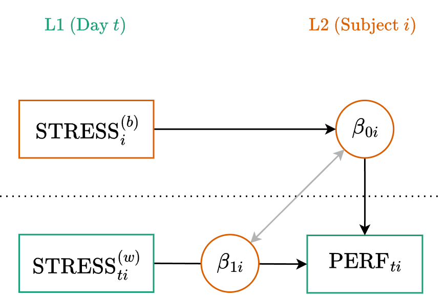
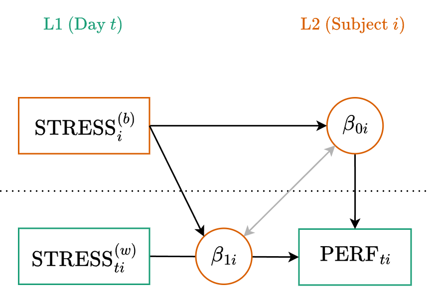

::: {.my-title}
# [Multilevel Modeling]{.blue}
Longitudinal Fluctuation

::: {.my-grey}
[ | CLAS | ]{}<br />
[Jeffrey M. Girard | Lecture ]{}
:::

{.absolute bottom=30 right=0 width="400"}
:::

```{r setup}
#| echo: false
#| message: false

library(tidyverse)
library(easystats)
library(patchwork)
library(here)
library(glmmTMB)

source(here("_common.R"))

set_theme(theme_classic(base_size = 20))

options(width = 80)
```

## Roadmap

::: {.columns .pv4}

::: {.column width="60%"}
1. Longitudinal Fluctuation
    + *Longitudinal Taxonomy*
    + *State vs. Trait Predictors*
  
2. Advanced Applications
    + *State-Trait Automoderation*
    + *Spatial Exponential Errors*
    
:::

::: {.column .tc .pv4 width="40%"}

:::

:::

# Longitudinal Concepts

## Taxonomy of Longitudinal Models

:::{.fsmaller}
- [Fluctuation Models:]{.b .blue} The outcome rises and falls around a stable baseline. There is no systematic long-term trajectory. (Covered this week)
    + *Example: Daily mood, daily stress, heart rate.*

:::{.fragment}
- [Growth Curve Models:]{.b .red} The outcome systematically changes over time,<br>
e.g., increasing, decreasing, or curving. (Covered next week)
    + *Example: Child vocabulary acquisition, therapy outcomes.*
    
:::

:::{.fragment}
- **Lagged Change Models:** We care about how the outcome at Time *t* predicts the outcome at Time *t+1*. (Not covered in this course, difficult with MLM)
    + *Example: Does poor sleep tonight predict lower mood tomorrow?*
    
:::
:::

## Visualizing Fluctuation and Growth

```{r}
#| echo: false
#| fig-width: 11
#| fig-height: 5

set.seed(12345)
time_pts <- 1:15

# 1. Simulate Fluctuation Data
fluct_data <- data.frame(
  time = time_pts,
  baseline = 50, 
  observed = 50 + rnorm(length(time_pts), mean = 0, sd = 8)
)

# 2. Simulate Growth Data
growth_data <- data.frame(
  time = time_pts,
  baseline = 30 + 3 * time_pts, 
  observed = 30 + 3 * time_pts + rnorm(length(time_pts), mean = 0, sd = 4)
)

# Plot 1: Fluctuation
p_fluct <- ggplot(fluct_data, aes(x = time)) +
  # Draw the stable baseline (trait)
  geom_hline(yintercept = 50, linetype = "dashed", color = "gray60", linewidth = 0.8) +
  # Draw the residuals (within-person fluctuation)
  geom_segment(aes(xend = time, y = baseline, yend = observed), 
               color = "#357EDD", linewidth = 1.5) +
  # Draw the observed points
  geom_point(aes(y = observed), size = 3, color = "black") +
  scale_y_continuous(limits = c(20, 80)) +
  theme_classic(base_size = 20) +
  labs(
    title = "Fluctuation",
    subtitle = "Focus: Predicting the deviations",
    x = "Time",
    y = "Outcome"
  )

# Plot 2: Growth
p_growth <- ggplot(growth_data, aes(x = time)) +
  # Draw the residuals (within-person fluctuation around the trend)
  geom_segment(aes(xend = time, y = baseline, yend = observed), 
               color = "gray80", linewidth = 0.8) +
  # Draw the changing baseline (trajectory)
  geom_line(aes(y = baseline), linetype = "dashed", color = "#E7040F", linewidth = 1.2) +
  # Draw the observed points
  geom_point(aes(y = observed), size = 3, color = "black") +
  scale_y_continuous(limits = c(20, 80)) +
  theme_classic(base_size = 20) +
  labs(
    title = "Growth",
    subtitle = "Focus: Modeling the shape of change",
    x = "Time",
    y = "" 
  )

# Combine
p_fluct + p_growth
```


# Modeling Fluctuation

## Overview

- Fluctuation models are perfect for Ecological Momentary Assessment (EMA) or daily diary designs.
- We want to know how temporary changes in a predictor (a state) relate to temporary changes in an outcome.
- To do this correctly, we must decompose our Level 1 predictors.

## The EMA Example

**Main Variables**

- Outcome = `performance` (numeric score on a daily task)
- Predictor = `stress` (self-reported daily stress)
- Time = `studyday_frac` (the exact fractional day of the study)

**Research Question**

- Does a person's *daily stress* (state) predict their *daily performance*, and does their *average stress* (trait) predict their *average performance*?

## Example Data

```{r}
#| message: false
#| replace_path: ["../../data/", ""]

library(tidyverse)
library(glmmTMB)
library(easystats)

ema <- read_csv("../../data/ema_sim.csv")
glimpse(ema)
```

:::{.fsmaller}
- We plan to predict `performance` (L1) from `stress` (L1) for each subject.
- Participants are pinged at random hours across the study.
:::

## L1 Predictor Decomposition

:::{.fsmaller}
If we use `stress` as a predictor, its slope will be an *uninterpretable blend* of the within-person and between-person effects. We must first decompose it!
:::

```{r}
ema_prep <- ema |> 
  mutate(
    .by = subject,
    stress_b = mean(stress, na.rm = TRUE), # Trait (L2)
    stress_w = stress - stress_b           # State (L1)
  ) |> 
  print(n = 3)
```

## How important was this?

:::{.fsmaller}
Calculating the predictor's ICC can help us understand its multilevel structure
:::

```{r}
fit_stress <- glmmTMB(stress ~ 1 + (1 | subject), data = ema)
icc(fit_stress)
```

:::{.fsmaller .mt4}
- **ICC near 0:** The variable is almost entirely a *state*. Everyone has the same baseline, and all the action is in day-to-day fluctuation.
- **ICC near 1:** The variable is almost entirely a *trait*. People differ from one another, but their daily scores never change from their baseline.
- **ICC in between:** The variable has meaningful variance at both levels. We **must** decompose it to avoid an uninterpretable, blended slope.

:::

## Multilevel Equation

:::{.tc .b}
Level One (Observation)
:::

$$y_{ti} = \beta_{0i} + \beta_{1i} x_{ti}^{(w)} + \color{#4daf4a}{e_{ti}}$$

:::{.tc .b}
Level Two (Cluster)
:::

$$\begin{align}
\beta_{0i} &= \color{#377eb8}{\gamma_{00}} + \color{#377eb8}{\gamma_{01}} x_{i}^{(b)} +  \color{#e41a1c}{u_{0i}} \\
\beta_{1i} &= \color{#377eb8}{\gamma_{10}} + \color{#e41a1c}{u_{1i}}
\end{align}$$

## Path Diagram



## Mixed (or Reduced) Equation

Substitute the L2 equations directly into the L1 equation:

$$y_{ti} = (\color{#377eb8}{\gamma_{00}} + \color{#377eb8}{\gamma_{01}} x_{i}^{(b)} + \color{#e41a1c}{u_{0i}}) + (\color{#377eb8}{\gamma_{10}} + \color{#e41a1c}{u_{1i}}) x_{ti}^{(w)} + \color{#4daf4a}{e_{ti}}$$

:::{.fragment}
Distribute and rearrange to group the fixed and random parts:

$$y_{ti} = \underbrace{\color{#377eb8}{\gamma_{00}} + \color{#377eb8}{\gamma_{01}} x_{i}^{(b)} + \color{#377eb8}{\gamma_{10}} x_{ti}^{(w)}}_{\text{Fixed}} + \underbrace{\color{#e41a1c}{u_{0i}} + \color{#e41a1c}{u_{1i}} x_{ti}^{(w)}}_{\text{Random}} + \color{#4daf4a}{e_{ti}}$$
:::

## Formula

:::{.fsmaller}
$$y_{ti} = \underbrace{\color{#377eb8}{\gamma_{00}} + \color{#377eb8}{\gamma_{01}} x_{i}^{(b)} + \color{#377eb8}{\gamma_{10}} x_{ti}^{(w)}}_{\text{Fixed}} + \underbrace{\color{#e41a1c}{u_{0i}} + \color{#e41a1c}{u_{1i}} x_{ti}^{(w)}}_{\text{(Random)}} + \color{#4daf4a}{e_{ti}}$$

**Generic**

:::{.tc}
`y ~ 1 + x_b + x_w + (1 + x_w | cluster)`

where the [1 + x_b + x_w]{.blue} part is fixed<br>
and the [(1 + x_w | cluster)]{.red} part is random
:::

:::{.fragment}
**Example**

:::{.tc}
`performance ~ 1 + stress_b + stress_w`<br>
`+ (1 + stress_w | subject)`
:::
:::
:::

## Fitting the Model

```{r}
fit_base <- glmmTMB(
  formula = performance ~ 1 + stress_b + stress_w + (1 + stress_w | subject),
  data = ema_prep
)
```

```{r}
model_parameters(fit_base, effects = "fixed")
```

:::{.fsmaller .fragment .mt4}
Both traits and states matter. People with higher average stress perform worse overall $(\gamma_{01}=-2.06)$. Additionally, on days when a person is more stressed than their own baseline, their performance drops further $(\gamma_{10}=-0.96)$.
:::

## Interpreting the Random Effects {.smaller}

```{r}
model_parameters(fit_base, effects = "random")
```

- `SD (Intercept)` ($\tau_{00}=4.94$): Even after accounting for trait stress, there is substantial variation in people's baseline performance. 
- `SD (stress_w)` ($\tau_{11}=0.64$): The penalty for a stressful day is not identical for everyone. Some people are more reactive to daily stress than others.
- `Cor (Intercept~stress_w)` ($\tau_{10}=0.01$): There is virtually no correlation between baseline performance and stress reactivity.
- `SD (Residual)` ($\sigma=2.78$): The remaining daily fluctuation in performance that is not explained by state stress.

## Visualizing Random Effects

```{r}
#| message: false
#| fig-width: 10
#| fig-height: 5

estimate_relation(fit_base, by = c("stress_w", "subject=[sample 6]")) |> plot()
```

# Auto-Moderation

## Stress Reactivity

:::{.fsmaller}
Now that we have separated stress into Trait (L2) and State (L1) components, we can ask a more complex theoretical question.

:::{.fragment .mt4}
> Does a person's average stress level (Trait) moderate their reactivity to daily stress fluctuations (State)?

:::

:::{.fragment .mt4}
*Hypothesis: People who are chronically stressed may lack the coping resources to handle bad days. Therefore, the negative effect of daily stress on performance will be even stronger (steeper) for individuals with high average stress.*
:::
:::

## Multilevel Equation

:::{.tc .b}
Level One (Observation)
:::

$$y_{ti} = \beta_{0i} + \beta_{1i} x_{ti}^{(w)} + \color{#4daf4a}{e_{ti}}$$

:::{.tc .b}
Level Two (Cluster)
:::

$$\begin{align}
\beta_{0i} &= \color{#377eb8}{\gamma_{00}} + \color{#377eb8}{\gamma_{01}} x_{i}^{(b)} +  \color{#e41a1c}{u_{0i}} \\
\beta_{1i} &= \color{#377eb8}{\gamma_{10}} + \underbrace{\color{#377eb8}{\gamma_{11}} x_{i}^{(b)}}_{\text{New}} + \color{#e41a1c}{u_{1i}}
\end{align}$$

## Path Diagram



## Fitting the Model

```{r}
fit_auto <- glmmTMB(
  formula = performance ~ 1 + stress_b * stress_w + (1 + stress_w | subject),
  data = ema_prep
)
model_parameters(fit_auto, effects = "fixed")
```

## Simple Slopes Analysis

```{r}
#| message: false

estimate_slopes(fit_auto, slope = "stress_w", by = "stress_b=[quartiles]")
```

:::{.fsmaller}
The performance cost of daily (state) stress is largest for those with higher average (trait) stress. There is evidence of a "compounding" effect.
:::

## Visualizing the Model

```{r}
estimate_relation(fit_auto, by = c("stress_w", "stress_b=[quartiles]")) |> plot()
```

# Continuous Time

## The Unequal Time Problem

:::{.fsmaller}
- `ar1()` assumes that the time between consecutive steps is identical.
- In EMA designs, participants may be pinged at different times of day.
:::

:::{.fragment}
```{r}
ema_prep |> filter(subject == 1) |> print(n = 3)
```

:::{.fsmaller}
The gap between the 9 AM and 2 PM prompts is 5 hours, but the overnight gap is 14 hours. Because discrete `ar1()` just looks at the sequence of steps, it forces the 5-hour gap and the 14-hour gap to have the exact same correlation!
:::
:::

## The Spatial Exponential Model

:::{.fsmaller}
- This covariance structure calculates the **true time gap** $(\Delta t=|t-t'|)$ between any two observations to handle continuous fractional time.
:::

:::{.fragment}
$$\color{#4daf4a}{\mathbf{v}_i} \sim \text{EXP}(0, \color{#4daf4a}{\sigma_v}, \color{#4daf4a}{\rho})$$
:::

:::{.fragment}
$$\text{Corr}(v_{ti}, v_{t'i}) = \rho^{\Delta t}$$

:::{.fsmaller}
- $\color{#4daf4a}{\sigma_v}$: The amount of autocorrelated error.
- $\color{#4daf4a}{\rho}$: The strength of the autocorrelation (for a 1-unit time gap).
:::
:::

## The Exponential Decay in Action

:::{.fsmaller}
Because the correlation structure follows an exponential decay $(\rho^{\Delta t})$, the autocorrelation carrying over from one prompt to the next depends heavily on your baseline 1-day strength $(\rho)$.

:::{.columns}
:::{.column}
**Weak Autocorrelation ($\rho = 0.20$)**

- 0.5-Day Gap: $0.20^{0.5} = 0.45$
- 1.5-Day Gap: $0.20^{1.5} = 0.09$
:::

:::{.column}
**Strong Autocorrelation ($\rho = 0.80$)**

- 0.5-Day Gap: $0.80^{0.5} = 0.89$
- 1.5-Day Gap: $0.80^{1.5} = 0.72$
:::
:::

The math automatically scales the correlation dynamically based on the exact fractional distance between observations.
:::

## Visualizing the Decay

```{r}
#| echo: false
#| fig-width: 10
#| fig-height: 5

decay_df <- 
  expand_grid(
    gap = seq(0, 5, by = 0.1),
    rho = seq(0.2, 0.8, by = 0.2)
  ) |> 
  mutate(correlation = rho^gap, rho = factor(rho))

ggplot(decay_df, aes(x = gap, y = correlation, color = rho)) +
  geom_line(linewidth = 1.5) +
  scale_y_continuous(limits = c(0, 1), breaks = seq(0, 1, 0.2)) +
  scale_color_manual(
    
    values = c("#bdc9e1", "#74a9cf", "#2b8cbe", "#045a8d")
  ) +
  labs(
    x = "True Time Gap (Fractional Days)",
    y = "Autocorrelation",
    color = "rho (𝜌)"
  ) +
  theme_classic(base_size = 20)
```

## Prepping the Time Factor

:::{.fsmaller}
To use the `exp()` covariance structure, we need to convert our continuous time variable into a special sorted number factor. 
:::

```{r}
ema_clean <- 
  ema_prep |> 
  # Sort by exact time within subjects
  arrange(subject, studyday_frac) |> 
  # Create a numFactor for exp() using the continuous variable
  mutate(time = numFactor(studyday_frac)) |> 
  print(n = 3)
```


## Fitting the Exponential Model

:::{.fsmaller}
We simply add the `exp()` term and use our continuous time factor.
:::

```{r}
fit_exp <- glmmTMB(
  formula = performance ~ 
    1 + stress_b * stress_w +       # fixed Effects
    (1 + stress_w | subject) +      # random Effects
    exp(0 + time | subject),   # exp by time (no intercept)
  data = ema_clean
)
model_parameters(fit_exp, effects = "fixed")
```

## Did the Exponential Decay Help?

```{r}
#| message: false

# Compare to our baseline auto-moderation model
test_lrt(fit_auto, fit_exp)

compare_performance(fit_auto, fit_exp, metrics = c("AIC", "BIC"))
```
