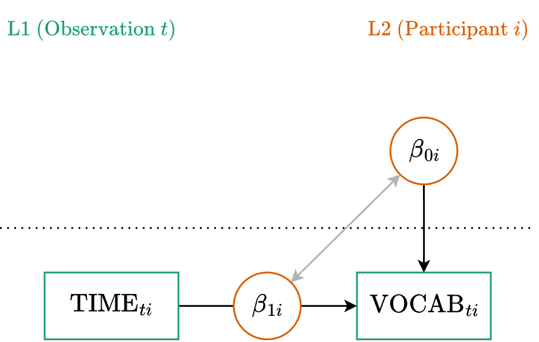

::: {.my-title}
# [Multilevel Modeling]{.blue}
Characterizing Change

::: {.my-grey}
[ | CLAS | ]{}<br />
[Jeffrey M. Girard | Lecture ]{}
:::

{.absolute bottom=30 right=0 width="400"}
:::

```{r setup}
#| echo: false
#| message: false

library(tidyverse)
library(easystats)
library(patchwork)
library(here)
library(glmmTMB)

source(here("_common.R"))

set_theme(theme_classic(base_size = 20))

options(width = 75)
```

## Roadmap

::: {.columns .pv4}

::: {.column width="60%"}
1. Unconditional Growth Models
    + *Structuring Time*
    + *Linear Trajectories*
    + *Nonlinear Trajectories*
    
2. Interpreting Curves
    + *Visualizing Trajectories*
    + *Articulating the Curve*
    
:::

::: {.column .tc .pv4 width="40%"}

:::

:::

# Unconditional Growth

## Fluctuation vs. Growth

```{r}
#| echo: false
#| fig-width: 11
#| fig-height: 5

set.seed(12345)
time_pts <- 1:15

# 1. Simulate Fluctuation Data
fluct_data <- data.frame(
  time = time_pts,
  baseline = 50, 
  observed = 50 + rnorm(length(time_pts), mean = 0, sd = 8)
)

# 2. Simulate Growth Data
growth_data <- data.frame(
  time = time_pts,
  baseline = 30 + 3 * time_pts, 
  observed = 30 + 3 * time_pts + rnorm(length(time_pts), mean = 0, sd = 4)
)

# Plot 1: Fluctuation
p_fluct <- ggplot(fluct_data, aes(x = time)) +
  geom_hline(yintercept = 50, linetype = "dashed", color = "gray60", linewidth = 0.8) +
  geom_segment(aes(xend = time, y = baseline, yend = observed), 
               color = "#357EDD", linewidth = 1.5) +
  geom_point(aes(y = observed), size = 3, color = "black") +
  scale_y_continuous(limits = c(20, 80)) +
  theme_classic(base_size = 20) +
  labs(
    title = "Fluctuation (Week 11)",
    subtitle = "Focus: Predicting the deviations",
    x = "Time",
    y = "Outcome"
  )

# Plot 2: Growth
p_growth <- ggplot(growth_data, aes(x = time)) +
  geom_segment(aes(xend = time, y = baseline, yend = observed), 
               color = "gray80", linewidth = 0.8) +
  geom_line(aes(y = baseline), linetype = "dashed", color = "#E7040F", linewidth = 1.2) +
  geom_point(aes(y = observed), size = 3, color = "black") +
  scale_y_continuous(limits = c(20, 80)) +
  theme_classic(base_size = 20) +
  labs(
    title = "Growth (Week 12)",
    subtitle = "Focus: Modeling the trajectories",
    x = "Time",
    y = "" 
  )

# Combine
p_fluct + p_growth
```

## Modeling the Trajectory

:::{.fsmaller}
- In Week 11, we treated the baseline as stable. We were most interested in the observation-specific fluctuations around that baseline.
- Moving forward with longitudinal change models, we are now most interested in the **shape of change** over the entire assessment period.
- We want to know the *starting point*, the overall *trajectory*, and the overall *shape* (e.g., linear, quadratic, or logarithmic). 
- To capture this shape, we simply **add a time variable (or variables) to the model as a Level 1 predictor**. 
- Random intercepts will allow each participant to have their own starting point and random time slopes will allow each to have their own trajectory.
:::

## Centering Time

:::{.fsmaller}
- The **intercept** represents the expected outcome when all predictors equal zero. Therefore, we need to be mindful about what zero represents for *time*.
- *If we study grades 9 through 12, then using the numbers `9` to `12` will result in an intercept corresponding to grade 0, which isn't very meaningful here.*

:::{.fragment .mt1}
- We usually [center]{.b .blue} time so that `0` and the intercept represent a meaningful starting point such as the first or baseline assessment in the study.
- *We can re-code time (by subtracting 9) so that `0` and the intercept represent grade 9, and `1`, `2`, and `3` represent grades 10, 11, and 12, respectively.*
:::
:::

## Scaling Time

:::{.fsmaller}
- The **slope** of a predictor represents the expected change in the outcome for a 1-unit increase in that predictor. Therefore, we need to be mindful about what a 1-unit increase actually represents for *time*.
- *If a 10-year study records time in days (from `0` to `3650`), the slope will represent daily growth. This coefficient might be uninterpretable or confusingly small (e.g., a gain of 0.002).*

:::{.fragment .mt1}
- We usually [scale]{.b .blue} time so that `1` represents a meaningful, intuitive interval like "one year" or "one academic semester".
- *We can re-code time (by dividing days by 365) so that `1` represents a full year. The slope now reflects a much more intuitive gain of 0.73 per year.*
:::
:::

## Example Data

```{r}
#| message: false
#| replace_path: ["../../data/", ""]

library(tidyverse)
vocab_raw <- read_csv("../../data/vocab_sim.csv")
glimpse(vocab_raw)
```

:::{.fsmaller}
Each of 150 subjects was assessed for vocabulary size annually. Notice that our time variable is `age_months`, starting at 120 months (10 years old). 
:::

## Preparing the Time Variable

:::{.fsmaller}
If we use `age_months` as our predictor, our intercept will represent vocabulary at an age of 0 months, and our slope will represent month-to-month growth. We need to fix this!
:::

```{r}
vocab <- vocab_raw |> 
  mutate(
    # Center at 120 months (Baseline), then scale by 12 (Years)
    time = (age_months - 120) / 12
  ) |> 
  print(n = 3)
```

## Multilevel Equation (Linear)

:::{.tc .b}
Level One (Observation)
:::

$$y_{ti} = \beta_{0i} + \beta_{1i} \text{TIME}_{ti} + \color{#4daf4a}{e_{ti}}$$

:::{.tc .b}
Level Two (Cluster)
:::

$$\begin{align}
\beta_{0i} &= \color{#377eb8}{\gamma_{00}} + \color{#e41a1c}{u_{0i}} \\
\beta_{1i} &= \color{#377eb8}{\gamma_{10}} + \color{#e41a1c}{u_{1i}}
\end{align}$$

:::{.fsmaller .mt4}
Notice that time is the only predictor in the model. We are just defining the average starting point ($\color{#377eb8}{\gamma_{00}}$) and the average rate of linear change ($\color{#377eb8}{\gamma_{10}}$), along with how much different people vary around those averages.
:::

## Path Diagram



## Mixed (or Reduced) Equation

Substitute the L2 equations directly into the L1 equation:

$$y_{ti} = (\color{#377eb8}{\gamma_{00}} + \color{#e41a1c}{u_{0i}}) + (\color{#377eb8}{\gamma_{10}} + \color{#e41a1c}{u_{1i}}) \text{TIME}_{ti} + \color{#4daf4a}{e_{ti}}$$

:::{.fragment}
Distribute and rearrange to group the fixed and random parts:

$$y_{ti} = \underbrace{\color{#377eb8}{\gamma_{00}} + \color{#377eb8}{\gamma_{10}} \text{TIME}_{ti}}_{\text{Fixed}} + \underbrace{\color{#e41a1c}{u_{0i}} + \color{#e41a1c}{u_{1i}} \text{TIME}_{ti}}_{\text{Random}} + \color{#4daf4a}{e_{ti}}$$
:::

## Formula

:::{.fsmaller}
$$y_{ti} = \underbrace{\color{#377eb8}{\gamma_{00}} + \color{#377eb8}{\gamma_{10}} \text{TIME}_{ti}}_{\text{Fixed}} + \underbrace{\color{#e41a1c}{u_{0i}} + \color{#e41a1c}{u_{1i}} \text{TIME}_{ti}}_{\text{(Random)}} + \color{#4daf4a}{e_{ti}}$$

**Generic**

:::{.tc}
`y ~ 1 + time + (1 + time | cluster)`

where the [1 + time]{.blue} part is fixed<br>
and the [(1 + time | cluster)]{.red} part is random
:::

:::{.fragment}
**Example**

:::{.tc}
`vocab ~ 1 + time + (1 + time | subject)`
:::
:::
:::

## Fitting the Linear Model

```{r}
fit_linear <- glmmTMB(
  formula = vocab ~ 1 + time + (1 + time | subject),
  data = vocab
)
model_parameters(fit_linear, effects = "all")
```

## Interpreting the Linear Model

:::{.fsmaller}
**Fixed Effects (The Average Trajectory)**

- `(Intercept)` ($\gamma_{00}$): The average expected vocabulary score at Baseline (`time = 0`).
- `time` ($\gamma_{10}$): The average expected change in vocabulary score for every 1-year increase.

:::{.fragment}
**Random Effects (The Variance)**

- `SD (Intercept)` ($\tau_{00}$): The variation in starting scores among subjects.
- `SD (time)` ($\tau_{11}$): The variation in the rate of linear growth among subjects.
- `Cor (Intercept~time)` ($\tau_{10}$): The correlation between starting point and growth rate. A negative correlation suggests that those who start lower tend to grow faster.
:::
:::

# Nonlinear Trajectories

## Adding a Curve

- Linear models assume a constant rate of change. 
- In many developmental or learning processes, growth is rapid at first and then levels off.
- We can model this by adding a **quadratic effect** (Time squared) to both our fixed and random effects.

## The Multicollinearity Problem

- Using raw polynomials (literally squaring the time variable) introduces massive multicollinearity because Time and Time-Squared are highly correlated.
- This correlation can cause complex models to crash or fail to converge.
- **The Solution:** We use **Orthogonal Polynomials**. This mathematical trick transforms our time variable into entirely uncorrelated chunks of variance. 
- **The Catch:** The coefficients are no longer in real-world units, so we cannot interpret the numbers directly. We only use the summary table to check the *p*-values!

## Formula and Fit (Orthogonal)

:::{.fsmaller}
In R, we use the `poly()` function. By default, it generates orthogonal polynomials to protect our model from multicollinearity. 
:::

```{r}
fit_quad <- glmmTMB(
  formula = vocab ~ 1 + poly(time, 2) + (1 + poly(time, 2) | subject),
  data = vocab
)
model_parameters(fit_quad, effects = "fixed")
```

:::{.fsmaller .mt4}
**Interpretation:** Do not interpret the `estimate` values. Just look at the *p*-values. Both the linear term and the quadratic term are statistically significant. The trajectory is officially curved.
:::

## Logarithmic Growth

:::{.fsmaller}
- Sometimes a quadratic curve forces an artificial U-shape when we actually just expect continuous, flattening growth like a classic learning curve.
- A logarithmic curve is perfect for this. 
- **The Catch:** The log of 0 is mathematically undefined. Because our Baseline is `time = 0`, we must calculate `log(time + 1)`. Conveniently, `log(0 + 1)` equals `0`, keeping our intercept firmly at Baseline!
:::

```{r}
fit_log <- glmmTMB(
  formula = vocab ~ 1 + log(time + 1) + (1 + log(time + 1) | subject),
  data = vocab
)
model_parameters(fit_log, effects = "fixed")
```

## Which shape fits best?

```{r}
#| message: false

compare_performance(fit_linear, fit_quad, fit_log, metrics = c("AIC", "BIC"))
```

:::{.fsmaller .pv4}
In our simulated data, the Quadratic model has the lowest AIC and BIC, suggesting it provides the best fit for this specific trajectory. 
:::

# Interpreting Curves

## Visualizing Trajectories

- If orthogonal polynomial coefficients are uninterpretable, how do we explain the results?
- We let `easystats` do the translation for us. Functions like `estimate_relation()` take the abstract math and map it back onto the original, real-world units of our time variable.

## The Visual Translation

```{r}
#| fig-width: 12
#| fig-height: 5

p1 <- estimate_relation(fit_linear, by = "time") |> plot() + labs(title = "Linear", y = "Vocab")
p2 <- estimate_relation(fit_quad, by = "time") |> plot() + labs(title = "Quadratic", y = "")
p3 <- estimate_relation(fit_log, by = "time") |> plot() + labs(title = "Logarithmic", y = "")

p1 + p2 + p3
```

## Articulating the Curve

- Plots are excellent for visualizing a nonlinear trajectory, but writing the results section requires specific numbers.
- How do we know exactly *when* the growth flattens out?
- The `describe_nonlinear()` function calculates the slope at many points along the curve and tells us exactly where the trend is significant.

## Extracting the Narrative

```{r}
#| message: false

# Generate a dense prediction grid for precise derivative calculations
pred_curve <- estimate_relation(fit_quad, by = "time", length = 100)

describe_nonlinear(pred_curve, x = "time")
```

:::{.fsmaller .mt4}
**Interpreting the Output:**
The algorithm has partitioned our curve into distinct phases. From Year 0 to roughly Year 3.3, vocabulary increases significantly (the slope is positive and significant). From Year 3.3 to Year 5, the slope is no longer significantly different from zero. The growth has officially plateaued. 
:::
