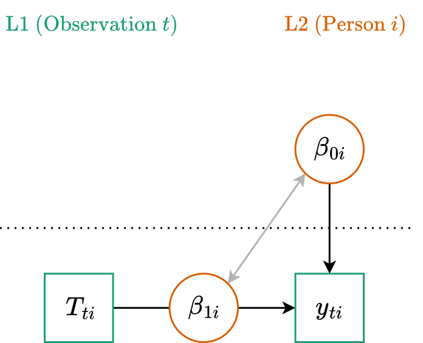

::: {.my-title}
# [Multilevel Modeling]{.blue}
Characterizing Change

::: {.my-grey}
[ | CLAS | ]{}<br />
[Jeffrey M. Girard | Lecture ]{}
:::

{.absolute bottom=30 right=0 width="400"}
:::

```{r setup}
#| echo: false
#| message: false

library(tidyverse)
library(easystats)
library(patchwork)
library(here)
library(glmmTMB)

source(here("_common.R"))

set_theme(theme_classic(base_size = 20))

options(width = 75)
```

## Roadmap

::: {.columns .pv4}

::: {.column width="60%"}
1. Linear Trajectories
    + *Structuring Time*
    + *Growth Modeling*
    
2. Nonlinear Trajectories
    + *Transforming Time*
    + *Instantaneous Change*
    
:::

::: {.column .tc .pv4 width="40%"}

:::

:::

# Linear Trajectories

## Fluctuation vs. Growth

```{r}
#| echo: false
#| fig-width: 11
#| fig-height: 5

set.seed(12345)
time_pts <- 1:15

# 1. Simulate Fluctuation Data
fluct_data <- data.frame(
  time = time_pts,
  baseline = 50, 
  observed = 50 + rnorm(length(time_pts), mean = 0, sd = 8)
)

# 2. Simulate Growth Data
growth_data <- data.frame(
  time = time_pts,
  baseline = 30 + 3 * time_pts, 
  observed = 30 + 3 * time_pts + rnorm(length(time_pts), mean = 0, sd = 4)
)

# Plot 1: Fluctuation
p_fluct <- ggplot(fluct_data, aes(x = time)) +
  geom_hline(yintercept = 50, linetype = "dashed", color = "gray60", linewidth = 0.8) +
  geom_segment(aes(xend = time, y = baseline, yend = observed), 
               color = "#357EDD", linewidth = 1.5) +
  geom_point(aes(y = observed), size = 3, color = "black") +
  scale_y_continuous(limits = c(20, 80)) +
  theme_classic(base_size = 20) +
  labs(
    title = "Fluctuation (Week 11)",
    subtitle = "Focus: Predicting the deviations",
    x = "Time",
    y = "Outcome"
  )

# Plot 2: Growth
p_growth <- ggplot(growth_data, aes(x = time)) +
  geom_segment(aes(xend = time, y = baseline, yend = observed), 
               color = "gray80", linewidth = 0.8) +
  geom_line(aes(y = baseline), linetype = "dashed", color = "#E7040F", linewidth = 1.2) +
  geom_point(aes(y = observed), size = 3, color = "black") +
  scale_y_continuous(limits = c(20, 80)) +
  theme_classic(base_size = 20) +
  labs(
    title = "Growth (Week 12)",
    subtitle = "Focus: Modeling the trajectories",
    x = "Time",
    y = "" 
  )

# Combine
p_fluct + p_growth
```

## Modeling the Trajectory

:::{.fs80}
- In Week 11, we treated the baseline as stable. We were most interested in the observation-specific fluctuations around that baseline.
- Moving forward with longitudinal change models, we are now most interested in the **shape of change** over the entire assessment period.
- We want to know the *starting point*, the overall *trajectory*, and the overall *shape* (e.g., linear, quadratic, or logarithmic). 
- To capture this shape, we simply **add a time variable (or variables) to the model as a Level 1 predictor**. 
- Random intercepts will allow each participant to have their own starting point and random time slopes will allow each to have their own trajectory.
:::

## Centering Time

:::{.fs80}
- The **intercept** represents the expected outcome when all predictors equal zero. Therefore, we need to be mindful about what zero represents for *time*.
- *If we study grades 9 through 12, then using the numbers `9` to `12` will result in an intercept corresponding to grade 0, which isn't very meaningful here.*

:::{.fragment .mt1}
- We usually [center]{.b .blue} time so that `0` and the intercept represent a meaningful starting point such as the first or baseline assessment in the study.
- *We can re-code time (by subtracting 9) so that `0` and the intercept represent grade 9, and `1`, `2`, and `3` represent grades 10, 11, and 12, respectively.*
:::
:::

## Scaling Time

:::{.fs80}
- The **slope** of a predictor represents the expected change in the outcome for a 1-unit increase in that predictor. Therefore, we need to be mindful about what a 1-unit increase actually represents for *time*.
- *If a 10-year study records time in days (from `0` to `3650`), the slope will represent daily growth. This coefficient might be uninterpretable or confusingly small (e.g., a gain of 0.002).*

:::{.fragment .mt1}
- We usually [scale]{.b .blue} time so that `1` represents a meaningful, intuitive interval like "one year" or "one academic semester".
- *We can re-code time (by dividing days by 365) so that `1` represents a full year. The slope now reflects a much more intuitive gain of 0.73 per year.*
:::
:::

## Example Data

```{r}
#| message: false
#| replace_path: ["../../data/", ""]

library(tidyverse)
vocab_raw <- read_csv("../../data/vocab_sim.csv")
glimpse(vocab_raw)
```

:::{.fs80}
Each of 150 subjects was assessed for vocabulary size annually. Notice that our time variable is `age_months`, starting at 120 months (10 years old). 
:::

## Preparing the Time Variable

:::{.fs80}
If we use `age_months` as our predictor, our intercept will represent vocabulary at an age of 0 months, and our slope will represent month-to-month growth. We need to fix this!
:::

```{r}
vocab <- vocab_raw |> 
  mutate(
    # Center at 120 months (Baseline), then scale by 12 (Years)
    time = (age_months - 120) / 12
  ) |> 
  print(n = 3)
```

## Multilevel Equation (Linear)

:::{.tc .b}
Level One (Observation)
:::

$$y_{ti} = \beta_{0i} + \beta_{1i} T_{ti} + \color{#4daf4a}{e_{ti}}$$

:::{.tc .b}
Level Two (Cluster)
:::

$$\begin{align}
\beta_{0i} &= \color{#377eb8}{\gamma_{00}} + \color{#e41a1c}{u_{0i}} \\
\beta_{1i} &= \color{#377eb8}{\gamma_{10}} + \color{#e41a1c}{u_{1i}}
\end{align}$$

:::{.fs80 .mt4}
Notice that time is the only predictor in the model. We are just defining the average starting point ($\color{#377eb8}{\gamma_{00}}$) and the average rate of linear change ($\color{#377eb8}{\gamma_{10}}$), along with how much different people vary around those averages.
:::

## Multilevel Equation Part 2 {.fs80}

:::{.tc .b}
Level One (Observation)
:::

$$
\color{#4daf4a}{e_{ti}} \sim \text{Normal}(0, \color{#4daf4a}{\sigma})
$$

:::{.tc .b}
Level Two (Cluster)
:::

$$
\begin{bmatrix}\color{#e41a1c}{u_{0i}}\\ \color{#e41a1c}{u_{1i}}\end{bmatrix} \sim \text{MVN}\left(\begin{bmatrix}0\\0\end{bmatrix}, \begin{bmatrix}\color{#e41a1c}{\tau_{00}} & \\ \color{#e41a1c}{\tau_{10}} & \color{#e41a1c}{\tau_{11}}\end{bmatrix}\right)
$$

:::{.mt4}
- $\color{#4daf4a}{\sigma}$: The within-person spread around their own trajectory.
- $\color{#e41a1c}{\tau_{00}}$: The between-person spread in starting points at baseline.
- $\color{#e41a1c}{\tau_{11}}$: The between-person spread in the rate of growth over time.
- $\color{#e41a1c}{\tau_{10}}$: The correlation between a person's starting point and rate of growth.
:::

## Path Diagram



## Formula

:::{.fs80}
$$y_{ti} = \underbrace{\color{#377eb8}{\gamma_{00}} + \color{#377eb8}{\gamma_{10}} T_{ti}}_{\text{Fixed}} + \underbrace{\color{#e41a1c}{u_{0i}} + \color{#e41a1c}{u_{1i}} T_{ti}}_{\text{(Random)}} + \color{#4daf4a}{e_{ti}}$$

**Generic**

:::{.tc}
`y ~ 1 + T + (1 + T | person)`

where the [1 + T]{.blue} part is fixed<br>
and the [(1 + T | person)]{.red} part is random
:::

:::{.fragment}
**Example**

:::{.tc}
`vocab ~ 1 + time + (1 + time | subject)`
:::
:::
:::

## Fitting the Linear Model

```{r}
fit_linear <- glmmTMB(
  formula = vocab ~ 1 + time + (1 + time | subject),
  data = vocab
)
```

:::{.fragment}
```{r}
model_parameters(fit_linear, effects = "fixed")
```

:::{.fs80}
- `(Intercept)` ($\gamma_{00}$): The average expected vocabulary score at Baseline.
- `time` ($\gamma_{10}$): The average expected annual change in vocabulary score.
:::
:::

## Interpreting the Linear Model

```{r}
model_parameters(fit_linear, effects = "random")
```

:::{.fs80}
- `SD (Intercept)` ($\tau_{00}$): The variation in starting scores among subjects.
- `SD (time)` ($\tau_{11}$): The variation in the rate of linear growth among subjects.
- `Cor (Intercept~time)` ($\tau_{10}$): A negative correlation suggests that those who start lower tend to grow faster.
:::

## Visualizing Fixed Effects

```{r}
# Plot the growth curve for the average subject
estimate_relation(fit_linear, by = "time") |> plot()
```

## Visualizing Trajectories

```{r}
# Plot the growth curves for six randomly selected subjects
estimate_relation(fit_linear, by = c("time", "subject=[sample 6]")) |> plot()
```

## Linear Slopes

:::{.fs80}
In a linear model, the growth rate stays constant over time. Here, vocab growth is always 8.06 per year with no acceleration or deceleration possible.
:::

```{r}
estimate_slopes(fit_linear, trend = "time", by = "time")
```


# Nonlinear Trajectories

## Beyond Linear Growth

:::{.fs80}
- Linear models assume a constant rate of change. They force a straight line through the data.
- However, human behavior, learning, and biological processes rarely grow at exactly the same speed forever.
- To allow our trajectories to bend and take on nonlinear shapes, we simply apply **mathematical transformations** to our time variable.
- Instead of just predicting the outcome from raw Time, we can predict it from the Square of Time, the Logarithm of Time, the Exponentiation of Time, etc.
:::

## Visualizing the Shapes

```{r}
#| echo: false
#| fig-width: 12
#| fig-height: 4

set.seed(8675309)
time_pts <- seq(0, 10, by = 0.5)

# Simulate simple shapes
sim_shapes <- tibble(
  time = time_pts,
  quad_true = 50 - 10 * time + 1 * time^2,  # Adjusted to a U-shape
  log_true = 20 + 15 * log(time + 1),
  exp_true = 20 + 0.5 * exp(0.4 * time)
) |> 
  mutate(
    quad_obs = quad_true + rnorm(n(), 0, 3),
    log_obs = log_true + rnorm(n(), 0, 3),
    exp_obs = exp_true + rnorm(n(), 0, 3)
  )

# Plot 1: Quadratic (U-Shape)
p_quad <- ggplot(sim_shapes, aes(x = time)) +
  geom_point(aes(y = quad_obs), color = "gray60", size = 2) +
  geom_line(aes(y = quad_true), color = "#377eb8", linewidth = 1.5) +
  theme_classic(base_size = 18) +
  labs(
    title = "Quadratic", 
    subtitle = "poly(Time, 2)", 
    x = "Time", 
    y = "Outcome"
  )

# Plot 2: Logarithmic (Learning Curve)
p_log <- ggplot(sim_shapes, aes(x = time)) +
  geom_point(aes(y = log_obs), color = "gray60", size = 2) +
  geom_line(aes(y = log_true), color = "#e41a1c", linewidth = 1.5) +
  theme_classic(base_size = 18) +
  labs(
    title = "Logarithmic", 
    subtitle = "log(Time+1)", 
    x = "Time", 
    y = ""
  )

# Plot 3: Exponential (Hockey Stick)
p_exp <- ggplot(sim_shapes, aes(x = time)) +
  geom_point(aes(y = exp_obs), color = "gray60", size = 2) +
  geom_line(aes(y = exp_true), color = "#4daf4a", linewidth = 1.5) +
  theme_classic(base_size = 18) +
  labs(
    title = "Exponential", 
    subtitle = "exp(Time)", 
    x = "Time", 
    y = ""
  )

# Combine using patchwork
p_quad + p_log + p_exp
```

:::{.fs80}
- **Quadratic:** acceleration, deceleration, or reversal (e.g., marital satisfaction)
- **Logarithmic:** rapid early growth that plateaus (e.g., therapy response)
- **Exponential:** slow early growth that compounds (e.g., viral outbreak)
:::

## Returning to Our Data

:::{.fs80}
- Let's apply this theory to our `vocab` dataset. We are modeling vocabulary growth in children from Baseline (Age 10) to Year 5 (Age 15).
- Before we just test every math function in R, we should ask:<br>
[*Which shapes make theoretical sense for this process?*]{.b .blue}

:::{.fragment .mt4}
- [Exponential:]{.b .dark-red} Unlikely. Human vocabulary does not compound toward infinity; there are natural cognitive and linguistic ceilings.
- [Quadratic:]{.b .orange} Possible. Growth might be fast early on and then slow down significantly as they get older and possibly even reverse in old age.
- [Logarithmic:]{.b .dark-green} Highly likely. Language acquisition often follows a rapid early learning phase that gradually plateaus as ceilings are approached.
:::
:::

## Our Testing Plan

:::{.fs80}
- Based on our developmental theory, we will drop the Exponential model.
- We will formally test a **Quadratic** model and a **Logarithmic** model against our standard **Linear** baseline to see which shape best fits the actual data.
- Let's start by building the Quadratic model. We need to add a new predictor to our equation: **Time-Squared**.
:::

## Quadratic Equations

:::{.tc .b}
Level One (Observation)
:::

$$y_{ti} = \beta_{0i} + \beta_{1i} T_{ti} + \beta_{2i} T_{ti}^2 + \color{#4daf4a}{e_{ti}}$$

:::{.tc .b}
Level Two (Cluster)
:::

$$\begin{align}
\beta_{0i} &= \color{#377eb8}{\gamma_{00}} + \color{#e41a1c}{u_{0i}} \\
\beta_{1i} &= \color{#377eb8}{\gamma_{10}} + \color{#e41a1c}{u_{1i}} \\
\beta_{2i} &= \color{#377eb8}{\gamma_{20}} + \color{#e41a1c}{u_{2i}}
\end{align}$$

## Orthogonal Polynomials

- Using raw polynomials can introduce multicollinearity problems when $T$ and $T^2$ are highly correlated.

:::{.fragment}
- **The Solution:** We use [Orthogonal Polynomials]{.b .blue} via the `poly()` function to transform our time variable into fully uncorrelated linear and quadratic components.
:::

:::{.fragment}
- **The Catch:** The components are centered and re-scaled,<br>so the coefficient values cannot be interpreted normally.
:::

## Quadratic Modeling

```{r}
fit_quad <- glmmTMB(
  formula = vocab ~ 1 + poly(time, 2) + (1 + poly(time, 2) | subject),
  data = vocab
)
model_parameters(fit_quad, effects = "fixed")
```

:::{.fs80 .fragment}
The intercept is the overall average vocabulary score across all time points (due to centering). The significant and positive 1st degree term indicates the overall average growth trend is increasing. The significant and negative 2nd degree term indicates the trajectory is curved downwards (growth is slowing).
:::

## Quadratic Visualization

```{r}
# Plot the growth curve for the average subject
estimate_relation(fit_quad, by = "time") |> plot()
```

## Quadratic Visualization

```{r}
# Plot the growth curve for six randomly selected subjects
estimate_relation(fit_quad, by = c("time", "subject=[sample 6]")) |> plot()
```

## Quadratic Slopes

:::{.fs80}
In a quadratic model, the growth rate is accelerating or decelerating by a fixed, constant amount per one-unit increase in time. Here, vocab growth is always decelerating by 2.87 per year (see the diff column).
:::

```{r}
estimate_slopes(fit_quad, trend = "time", by = "time") |>
  mutate(diff = diff(c(NA, Slope)))
```

## Logarithmic Equations

:::{.tc .b}
Level One (Observation)
:::

$$y_{ti} = \beta_{0i} + \beta_{1i} \log(T_{ti}+1) + \color{#4daf4a}{e_{ti}}$$

:::{.tc .b}
Level Two (Cluster)
:::

$$\begin{align}
\beta_{0i} &= \color{#377eb8}{\gamma_{00}} + \color{#e41a1c}{u_{0i}} \\
\beta_{1i} &= \color{#377eb8}{\gamma_{10}} + \color{#e41a1c}{u_{1i}}
\end{align}$$

::: {.aside}
***Note:*** In R, `log()` defaults to the natural logarithm (base $e$). We add $+1$ to our time variable for two reasons. First, $\log(0)$ is undefined. Second, $\log(1)=0$, which ensures that our intercept still represents the expected outcome at $T=0$.
:::

## Logarithmic Modeling

```{r}
fit_log <- glmmTMB(
  formula = vocab ~ 1 + log(time + 1) + (1 + log(time + 1) | subject),
  data = vocab
)
model_parameters(fit_log, effects = "fixed")
```

:::{.fs80 .fragment}
The intercept represents the expected vocabulary score exactly at Baseline (Age 10). The significant and positive logarithmic term indicates that vocabulary size increases over time. This growth is modeled as fastest at the beginning and gradually slowing down over time.
:::

## Logarithmic Visualization

```{r}
# Plot the growth curve for the average subject
estimate_relation(fit_log, by = "time") |> plot()
```

## Logarithmic Visualization

```{r}
# Plot the growth curve for six randomly selected subjects
estimate_relation(fit_log, by = c("time", "subject=[sample 6]")) |> plot()
```

## Logarithmic Slopes

:::{.fs80}
In a logarithmic model, the growth rate changes non-uniformly over time, following a pattern of diminishing returns. Here, vocab growth decelerates rapidly at first and then more gradually over time (see the diff column).
:::

```{r}
estimate_slopes(fit_log, trend = "time", by = "time") |>
  mutate(diff = diff(c(NA, Slope)))
```


## Model Comparison

```{r}
#| message: false

compare_performance(fit_linear, fit_quad, fit_log, metrics = c("AIC", "BIC"))
```

:::{.fs80 .pv4}
In our simulated data, the Logarithmic change model has the lowest AIC and BIC, suggesting it provides the best fit for this specific process. Note as well that the weights for both metrics are overwhelmingly in favor of this model.
:::

## What about Autocorrelation?

- In Fluctuation models, it was important to use the AR1 or EXP covariance structure because we had no other way to explain why "today" looked like "yesterday"

- In Growth models, we have a systematic trend. We expect Year 2 to be related to Year 1 because they both sit on the same developmental path

- Usually, once the shape of the growth is correctly specified, the remaining residuals are independent enough that we don't need the extra complexity of AR1 or EXP
