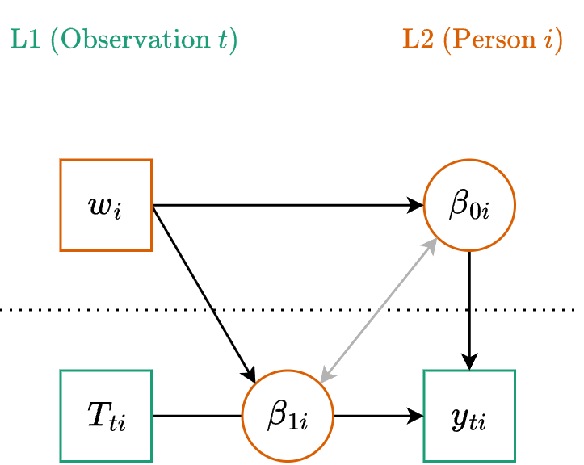

::: {.my-title}
# [Multilevel Modeling]{.blue}
Predicting Change

::: {.my-grey}
[ | CLAS | ]{}<br />
[Jeffrey M. Girard | Lecture ]{}
:::

{.absolute bottom=30 right=0 width="400"}
:::

```{r setup}
#| echo: false
#| message: false

library(tidyverse)
library(easystats)
library(patchwork)
library(here)
library(glmmTMB)

source(here("_common.R"))

set_theme(theme_gray(base_size = 24))
```

## Roadmap

::: {.columns .pv4}

::: {.column width="60%"}
1. Time-Invariant Predictors
    + *Explaining the Baseline*
    + *Explaining the Growth Rate*
    
2. Time-Varying Predictors
    + *Decomposing Predictors*
    + *Explaining the Fluctuations*
    
:::

::: {.column .tc .pv4 width="40%"}

:::

:::

# Time-Invariant Predictors

## Reviewing the Unconditional Model

:::{.fsmaller}
In 12a, we found that a logarithmic transformation of time best captured the vocabulary growth trajectory in our sample. This is an "unconditional" growth model because it contains no predictors other than time.
:::

```{r}
#| message: false
#| replace_path: ["../../data/", ""]

library(tidyverse)
library(glmmTMB)
library(easystats)

vocab <- read_csv("../../data/vocab_sim.csv") |> 
  # Center at Baseline, scale to Years
  mutate(time = (age_months - 120) / 12)

fit_log <- glmmTMB(
  vocab ~ 1 + log(time + 1) + (1 + log(time + 1) | subject),
  data = vocab
)
```

## Explaining the Variance

:::{.fsmaller}
- Our unconditional model tells us the average **starting point** and the average **rate of growth**. It also tells us that individuals vary around both of those averages. *Why are some individuals higher or lower than others?*

- We can now add **Level 2 Predictors** to try and explain that variation

- These are "time-invariant" variables that differ between people but remain constant for a given person over time (e.g., traits, person characteristics)

- For example, we might want to test if the reading `program` (A vs. B) affects a child's starting vocabulary or growth rate
:::

## Equations for Level 2 Predictors

:::{.tc .b}
Level One (Observation)
:::

$$y_{ti} = \beta_{0i} + \beta_{1i} T_{ti} + \color{#4daf4a}{e_{ti}}$$

:::{.tc .b}
Level Two (Cluster)
:::

$$\begin{align}
\beta_{0i} &= \color{#377eb8}{\gamma_{00}} + \color{#377eb8}{\gamma_{01}} w_i + \color{#e41a1c}{u_{0i}} \\
\beta_{1i} &= \color{#377eb8}{\gamma_{10}} + \color{#377eb8}{\gamma_{11}} w_i + \color{#e41a1c}{u_{1i}}
\end{align}$$

:::{.fsmaller .mt4}
Note that the L2 variable ($w_i$) is predicting both the intercept <br>($\beta_{0i}$, starting point) and the slope ($\beta_{1i}$, growth rate).
:::

## Path Diagram



## The Linear Formula

:::{.fsmaller}
- We have already seen this exact structure...
    + This is just a cross-level interaction!

:::

:::{.tc}
**Generic Formula**

`y ~ 1 + w * T + (1 + T | person)`
:::

:::{.fragment .tc}
**Mapping to Our Data**

`vocab ~ 1 + program * time +`<br>`(1 + time | subject)`
:::

## Wait a Minute...

:::{.fsmaller}
If we ran that model, we would be asking: *"Does the intervention program change the rate at which vocabulary grows in a perfectly straight line forever?"*

:::{.fragment .mt4}
But remember what we discovered in Lecture 12a! 

Vocabulary growth in this sample is **not linear**. It follows a rapid early learning phase that gradually plateaus. It is **logarithmic**.
:::

:::{.fragment .mt4}
We don't have to throw away our Level 2 equations! We just need to swap out raw Time for our logarithmic transformation. Let's update our formula.
:::
:::
## The Updated Formula

:::{.tc}
**Generic Nonlinear Formula**

`y ~ 1 + w * transform(time) +`<br>`(1 + transform(time) | person)`
:::

:::{.fragment .tc}
**Our Specific Model**

`vocab ~ 1 + program * log(time + 1) + `<br>`(1 + log(time + 1) | subject)`
:::

## Interpreting L2 Fixed Effects

:::{.fsmaller}
```{r}
fit_l2 <- glmmTMB(
  vocab ~ 1 + program * log(time + 1) + (1 + log(time + 1) | subject),
  data = vocab
)
model_parameters(fit_l2, effects = "fixed")
```

- **Intercept:** Average starting value in the A group.
- **Program effect:** The difference in starting values between groups.
- **Time effect:** Average rate of log-growth in the A group.
- **Interaction effect:** The difference in log-growth rates between groups.
:::

## Visualizing L2 Predictors

```{r}
estimate_relation(fit_l2, by = c("time", "program")) |> plot()
```

## Probing the Interaction

```{r}
# What is each group's rate of log-growth?
estimate_slopes(fit_l2, trend = "time", by = "program")
```


## Point-in-Time Contrasts

```{r}
# How much do the groups differ at each time point?
estimate_contrasts(fit_l2, contrast = "program", by = "time")
```

# Time-Varying Predictors

## Bridging Growth and Fluctuation

:::{.fsmaller}
- L2 predictors explain differences *between* trajectories. However, people also deviate from their own expected trajectories from observation to observation. 

- In Lecture 11b, we modeled these observation-specific deviations using fluctuation models. We can bring that same logic into our growth models by adding **L1 Predictors**. These are "time-varying" variables that change over time within an individual.

- In our data, we tracked how many `hours_read` each child completed in the weeks prior to their annual assessment. Does reading more than usual predict a bump in vocabulary above the growth curve?
:::

## Decomposing the Predictor

:::{.fsmaller}
Before we add a L1 predictor $x$ to the model, we should decompose it into between- and within-person components $x_i^{(b)}$ and $x_{ti}^{(w)}$
:::

```{r}
vocab2 <- vocab |> 
  mutate(
    .by = subject,
    read_b = mean(hours_read),
    read_w = hours_read - read_b
  ) |> 
  print(n = 3)
```

## Equations for Level 1 Predictors

:::{.tc .b}
Level One (Observation)
:::

$$y_{ti} = \beta_{0i} + \beta_{1i} \log(T_{ti}+1) + \beta_{2i} x_{ti}^{(w)} + \color{#4daf4a}{e_{ti}}$$

:::{.tc .b}
Level Two (Cluster)
:::

$$\begin{align}
\beta_{0i} &= \color{#377eb8}{\gamma_{00}} + \color{#377eb8}{\gamma_{01}} w_i + \color{#377eb8}{\gamma_{02}} x_i^{(b)} + \color{#e41a1c}{u_{0i}} \\
\beta_{1i} &= \color{#377eb8}{\gamma_{10}} + \color{#377eb8}{\gamma_{11}} w_i + \color{#e41a1c}{u_{1i}} \\
\beta_{2i} &= \color{#377eb8}{\gamma_{20}} + \color{#e41a1c}{u_{2i}}
\end{align}$$

## Formula and Fitting

:::{.fsmaller}
We add the between-person term as a standard fixed effect. We add the within-person term as a fixed effect, and we also add it to the random effects bracket to allow its effect to vary across subjects.
:::

:::{.fragment}
```{r}
fit_combined <- glmmTMB(
  formula = vocab ~ 1 + log(time + 1) * program + read_b + read_w + 
                    (1 + log(time + 1) + read_w | subject),
  data = vocab2
)
```
:::

## Interpreting L1 Fixed Effects

:::{.fsmaller}
```{r}
model_parameters(fit_combined, effects = "fixed")
```

- `read_b`: The between-person effect is non-significant. Children who generally read more do not necessarily have a higher baseline vocabulary.
- `read_w`: The within-person effect is significant and positive. In years when a child reads more than *their own* usual amount, their vocabulary score bumps up by about 1.5 points *above their expected trajectory*.
:::

## Visualizing the L1 Effect

```{r}
estimate_relation(fit_combined, by = "read_w") |> plot()
```

:::{.fsmaller .tc}
This plot shows the pure within-person effect. For every hour a child reads above their personal average, their vocabulary score is pushed upward away from their underlying growth curve.
:::

## Zooming in on Subject 42

:::{.fsmaller}
To understand how our model builds a prediction, let's deconstruct the trajectory for a single person. We use `estimate_grouplevel()` to extract Subject 42's specific random effect deviations.
:::

```{r}
estimate_grouplevel(fit_combined) |> 
  filter(Level == 42)
```

:::{.fsmaller .fragment .mt4}
They started higher than average (+0.56), grew slower than average (-7.55), and got a larger-than-average boost from reading (+0.54). 

We can combine these unique parameters with the fixed effects to calculate their exact trajectory. Let's visualize how this is built layer-by-layer.
:::

## Step 1: The Level 2 Baseline

:::{.fsmaller}
First, we plot the smooth, logarithmic trajectory predicted purely by Subject 42's Level 2 characteristics (their program and their personal random effects). This is what we expect if they always read their exact average amount.
:::

```{r}
#| echo: false
#| fig-width: 10
#| fig-height: 4.5

# Hidden Data Prep
sub_42 <- vocab2 |> filter(subject == 42)
preds_base <- estimate_expectation(fit_combined, data = sub_42 |> mutate(read_w = 0))
preds_adj <- estimate_expectation(fit_combined, data = sub_42)
plot_data <- sub_42 |> 
  mutate(
    base_curve = preds_base$Predicted,
    adj_curve = preds_adj$Predicted,
    observed = preds_adj$Predicted + preds_adj$Residuals
  )

# Plot 1
p_base <- ggplot(plot_data, aes(x = time)) +
  geom_line(aes(y = base_curve), color = "gray50", linewidth = 1.2, linetype = "dashed") +
  scale_y_continuous() +
  theme_classic(base_size = 18) +
  labs(
    y = "Vocabulary Score", 
    x = "Time (Years from Baseline)"
  )

p_base
```

## Step 2: The Level 1 Adjustments

:::{.fsmaller}
Next, we apply the Level 1 fluctuations. For every year Subject 42 read more or less than their personal average, the model adjusts the expected trajectory up or down, creating a jagged line.
:::

```{r}
#| echo: false
#| fig-width: 10
#| fig-height: 4.5

p_adj <- p_base +
  geom_line(aes(y = adj_curve), color = "#377eb8", linewidth = 1.2)

p_adj
```

## Step 3: The Observation Residuals

:::{.fsmaller}
Finally, we plot the actual data points. The remaining distance between the jagged, fluctuation-adjusted line and the raw data points represents our final Level 1 residuals ($e_{ti}$).
:::

```{r}
#| echo: false
#| fig-width: 10
#| fig-height: 4.5

p_final <- p_adj +
  geom_segment(aes(xend = time, y = adj_curve, yend = observed), 
               color = "#e41a1c", linetype = "dashed", linewidth = 0.8) +
  geom_point(aes(y = observed), size = 4, color = "black")

p_final
```
